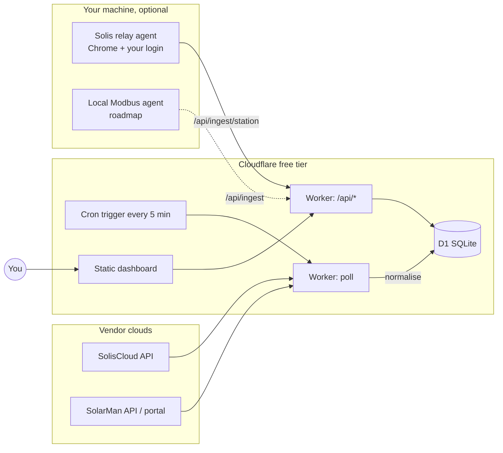

# SolarLens

**One screen for all your inverters.** SolarLens polls SolisCloud and SolarMan, stores every
reading in your own database, and shows both systems side by side — live power, today /
month / year / lifetime energy, grid import & export, battery state — on a page you can open
from any device. It runs entirely on Cloudflare's free tier (Workers + D1) or locally.

- **Two vendors, one model.** SolisCloud and SolarMan are normalised into the same reading shape, so the UI never cares where a number came from.
- **Your data, kept.** Every sample is stored (with the untouched vendor payload), so you get history the vendor apps don't let you keep or export.
- **Works with whatever access you have.** Official API keys are best; a browser-session fallback for SolarMan and a local relay agent for SolisCloud cover you while keys are pending.
- **Honest about freshness.** Every panel shows *when* it was last updated. A system reads **offline** the moment either the vendor says so or nothing has arrived for 25 minutes — and an offline system's live figures are zero, not whatever it managed just before it dropped.
- **Reads well in either theme.** A three-state toggle in the top-right corner follows your system, or forces light or dark; the choice is remembered and applied before first paint.
- **Labelled, not cryptic.** Every headline figure says what it is and what it covers — "Producing now", "Produced today", "Consumed today" — and each system's live output is set against its rated size.
- **Open it and it is there.** No login, no token to copy onto each device — the readings are public by design, with vendor identifiers stripped from every response before it leaves the Worker.
- **Each system's day ends where its own sun sets.** Every plant's timezone is stored, and every figure, curve and daily row is cut at that plant's midnight rather than at the reader's — so two systems in different countries are each shown their own day, on the same screen.
- **Fault history, with what the vendor advises.** Every alarm each vendor has on record, back to installation: when, how severe, the fault code, how long it lasted, and SolisCloud's own advice. SolarMan never records when a fault cleared, and the page says so rather than guessing.
- **Made for a wall, too.** TV mode at `#/tv` drops the header and tabs, sizes everything to the screen, keeps the display awake, and shows a clock so a frozen page is obvious from across a room.
- **History that goes back to the start.** Days, months or years. Months and years use each vendor's own totals, which reach back to the day the plant was installed, and every row says whether its figure is the vendor's or SolarLens's own and how many of its days SolarLens saw.
- **Installable.** Add it to a phone's home screen and it opens in its own window. The worker behind that goes to the network first and falls back to a cache only when there is none, so an installed copy can never show a stale reading as a live one.
- **Tested.** Unit tests for every normaliser and unit conversion; Playwright end-to-end tests for the dashboard on desktop and mobile.

> Not affiliated with Ginlong/Solis or IGEN Tech/SolarMan. 

---

## Contents

1. [How it works](#how-it-works)
2. [Data sources and how each authenticates](#data-sources-and-how-each-authenticates)
3. [Quick start (≈10 minutes)](#quick-start-10-minutes)
4. [Getting credentials](#getting-credentials) — [SolisCloud](#soliscloud-official-api-key) · [SolarMan](#solarman-official-business-api) · [SolarMan fallback](#solarman-browser-session-fallback)
5. [SolisCloud relay agent](#soliscloud-relay-agent) — [one command on Windows](#one-command-on-windows) · [more than one machine](#running-it-on-more-than-one-machine) · [replacing a token](#replacing-a-token)
6. [Configuration reference](#configuration-reference)
7. [Local development](#local-development)
8. [Testing](#testing) — [what runs on every pull request](#what-runs-on-every-pull-request) · [where the reports are](#where-the-reports-are)
9. [Data model](#data-model)
10. [HTTP API](#http-api)
11. [Project layout](#project-layout)
12. [Troubleshooting](#troubleshooting)
13. [Security and privacy](#security-and-privacy)
14. [Changelog](CHANGELOG.md) · [Handover](docs/handoff.md)
15. [Roadmap](#roadmap) · [Contributing](#contributing) · [License](#license)

---

## How it works



A single Cloudflare Worker does three jobs:

1. **Poller** — on a cron tick it asks each configured provider for its plants, then for each plant's live snapshot, normalises the vendor payload into one `Reading`, and inserts it (idempotently) into D1.
2. **API** — a few JSON endpoints over D1: latest reading per inverter, a time series for charts, poll health, and push endpoints for local agents.
3. **Static UI** — a dependency-free, hash-routed HTML page served from the same Worker. Five tabs, plus a per-system page they all link into:
   - **Overview** (`#/`) — one column per system, sized to fit a laptop screen without scrolling: the energy-flow diagram, then that system's figures as tiles, then its day curve. Producing now, house load, grid direction and battery charge live in the diagram and are not repeated as figures. Model and datalogger signal are not here at all — they never change, so they sit on Devices. Anything above the curve opens that system's detail page; the curve opens Power. Below 1080px wide the columns stack, and below 660px tall the page scrolls, because two systems will not fit on a phone and a very short window cannot hold a diagram, twelve figures and a readable curve at once.
   - **Power** (`#/power`) — the combined day curve (click a name in the legend to show or hide that line), then each system in a collapsible section carrying its full detail set: identity, datalogger, live power, counters, PV strings, per-phase AC, battery, diagnostics and raw telemetry.
   - **Historical Data** (`#/history`) — day by day per system: produced, consumed, imported, exported, battery in and out, peak and sample count, with a bar per day. Columns appear only where that system measures the quantity, and the page says plainly that the record begins when SolarLens started collecting rather than when the array was installed.
   - **Alerts** (`#/alerts`) — everything either cloud says is wrong, one collapsible section per system. Nothing is invented: each row names the field it came from, so an empty section reads as "both vendors report normal" rather than "nobody looked". The tab carries a count badge.
   - **Devices** (`#/devices`) — hardware inventory: inverters and dataloggers with serial, model, firmware, rated power, signal strength and last contact.
   - **System detail** (`#/system/<id>`) — identity and hardware, datalogger and link, live power, energy counters, per-MPPT-string PV power, battery (hybrid only), diagnostics, and a searchable raw-telemetry table.

   There is no Energy flow tab: the diagrams lead the overview instead, and an old `#/flow` bookmark lands there.

Every provider is an adapter behind one interface (`listPlants → listInverters → getReading`). A provider is active purely when its secrets are present, so the same deploy works with one vendor today and both tomorrow.

## Data sources and how each authenticates

| Route | Vendor | How it authenticates | Stability | When to use |
|---|---|---|---|---|
| **Official API** | SolisCloud | HMAC-SHA1-signed requests with `KeyId`/`KeySecret` | Documented, stable | Always, once Solis enables API access on your account |
| **Official Business API** | SolarMan | `appId`/`appSecret` + email + sha256(password) → bearer token (~2 months, auto-renewed) | Documented, stable | Always, once SolarMan issues your keys |
| **Web-session fallback** | SolarMan | Refresh token copied once from your browser; the Worker renews the 24 h access token itself | Unofficial; works until you log out or the portal changes | While waiting for keys |
| **Relay agent** | SolisCloud | Your logged-in Chrome session on your machine; the real portal makes the calls, the agent relays the responses | Unofficial; robust to portal releases, needs your PC on | While waiting for API access |
| Local Modbus | either | Direct LAN read of the datalogger | Planned | Second-by-second data, cloud-independent |

Why the difference between the two fallbacks: SolarMan's portal uses a plain bearer token that can be replayed from anywhere. SolisCloud's portal signs every call with a secret hidden in its JavaScript, so a copied token cannot be reused — the relay agent lets the portal itself do the signing instead. Details in [docs/api-notes.md](docs/api-notes.md).

## Quick start (≈10 minutes)

**Prerequisites:** Node.js 22 or newer, a free [Cloudflare account](https://dash.cloudflare.com/sign-up), and Git. `.nvmrc` pins 22, the version the automated checks use; newer versions are fine to develop on.

```bash
git clone https://github.com/<you>/SolarLens.git
cd SolarLens
npm install
```

**1. Log in to Cloudflare and create the database**

```bash
npx wrangler login
npx wrangler d1 create solar-lens
```

That prints a `database_id`. It is not a credential — nobody can touch the
database without your Cloudflare login — but it identifies your account, so
this repository keeps it out of version control. Put it in `.dev.vars`
instead, which is gitignored:

```bash
cp .dev.vars.example .dev.vars
```

and set the line:

```
CF_D1_DATABASE_ID=<the id wrangler just printed>
```

`wrangler.jsonc` carries the placeholder `${CF_D1_DATABASE_ID}`, and
`scripts/wrangler.mjs` substitutes your real id into a temporary, gitignored
copy of the config each time you run a command. **Because of that, use the npm
scripts rather than `npx wrangler` directly** — `npm run cf -- <anything>`
passes any wrangler command through the wrapper:

```bash
npm run db:remote                 # apply the schema to the deployed database
npm run cf -- d1 info solar-lens  # the general escape hatch
```

**2. Set your secrets** — each command prompts for the value; nothing is stored in the repo.

```bash
npm run cf -- secret put API_TOKEN       # gates the routes that write or spend quota
npm run cf -- secret put INGEST_TOKEN    # gates the push endpoints used by local agents
```

Generate strong tokens with:

```bash
node -e "console.log(require('crypto').randomBytes(24).toString('base64url'))"
```

Keep both somewhere you can find them again — a password manager, not a file
on the machine. Cloudflare will never show a secret back to you, so a lost
token can only be replaced, not recovered (see
[Replacing a token](#replacing-a-token)). Put the same values in `.dev.vars`
as well: the relay agent and `npm run dev` read them from there.

Then add whichever provider credentials you have (see [Getting credentials](#getting-credentials)):

```bash
npm run cf -- secret put SOLIS_KEY_ID
npm run cf -- secret put SOLIS_KEY_SECRET
# and/or
npm run cf -- secret put SOLARMAN_APP_ID
npm run cf -- secret put SOLARMAN_APP_SECRET
npm run cf -- secret put SOLARMAN_EMAIL
npm run cf -- secret put SOLARMAN_PASSWORD_SHA256
# or the SolarMan browser-session fallback
npm run cf -- secret put SOLARMAN_WEB_REFRESH_TOKEN
```

If you have neither vendor's API keys yet, that is the normal starting point —
both are approvals you have to request. Skip to
[Getting credentials](#getting-credentials) for how to ask, and use the
[SolarMan browser-session fallback](#solarman-browser-session-fallback) and the
[SolisCloud relay agent](#soliscloud-relay-agent) to have real data on screen
the same day.

**3. Deploy**

```bash
npm run deploy
```

This is the first deploy, from your own machine. Afterwards deploys happen
through the pipeline: merging to `main` runs the checks, waits for a person to
approve on GitHub, applies migrations, deploys and checks the live site - see
[what happens after a merge](#what-happens-after-a-merge).

The first deploy asks you to register a `workers.dev` subdomain (a one-time name for your account); pick one and run the deploy again. It prints your URL, e.g. `https://solar-lens.<your-subdomain>.workers.dev`.

**4. Open the dashboard**

Open `https://solar-lens.<your-subdomain>.workers.dev`. That is all — on any
phone, tablet or laptop, with nothing to copy first. Readings are public by
design, with vendor identifiers stripped from every response; see
[Reads are public; writes are not](#reads-are-public-writes-are-not) for exactly
what that publishes and how to put a login in front of it if your site needs
one.

The first data arrives on the next 5-minute cron tick, or immediately with:

```bash
curl -X POST -H "Authorization: Bearer <API_TOKEN>" https://solar-lens.<your-subdomain>.workers.dev/api/poll
```

> **Windows PowerShell:** `&&` is not a statement separator there — run chained commands on separate lines.

## Getting credentials

### SolisCloud (official API key)

1. In the SolisCloud web portal, check **avatar → Basic Settings** for an **API Management** section. If it is there: **Activate Now** → solve the puzzle → enter the emailed code → copy `KeyId` and `KeySecret`.
2. If it is **not** there, API access is not yet enabled on your account. Open the [Solis Service Center → Submit a ticket](https://solis-service.solisinverters.com/en/support/tickets/new), choose the **Service Support Ticket** form and fill it with:
   - Product Type **Monitoring Platform**, Product Name **Solis Cloud Web**
   - Tickets Type **API Request - System Owner** (this is the "API Access Request" the guide refers to)
   - your plant ID, country, and your SolisCloud login email as the *API Account Email Address*
   - a short description: read-only monitoring for a personal dashboard, system owner, no remote control needed.
3. Once approved, API Management appears under Basic Settings. Only end users (not installers) are eligible.

Response times vary widely — use the [relay agent](#soliscloud-relay-agent) in the meantime.

### SolarMan (official Business API)

Email `service@solarmanpv.com` asking for Business API `appId`/`appSecret`. Include your SolarMan login email, your station ID, that you are the system owner (not an installer/distributor), that you need read-only monitoring for a personal dashboard, and expected usage (one request every ~5 minutes). Replies usually take a day or two.

`SOLARMAN_PASSWORD_SHA256` is the SHA-256 hex of your SolarMan password:

```bash
node -e "console.log(require('crypto').createHash('sha256').update(process.argv[1]).digest('hex'))" 'your-password'
```

### SolarMan (browser-session fallback)

1. Log in at `https://home.solarmanpv.com` in Chrome.
2. Press F12 → **Application** → **Cookies** → `https://home.solarmanpv.com`.
3. Two cookies hold JWTs (`eyJ…`). The **persistent** one (expiry months away, ~940 bytes) is the **refresh token** — copy its value into `SOLARMAN_WEB_REFRESH_TOKEN`. The **Session** one (~880 bytes) is the access token; optionally copy it into `SOLARMAN_WEB_ACCESS_TOKEN` so the very first poll needs no refresh.
4. Do not log out of SolarMan in that browser — logging out revokes the tokens.

Password login is deliberately *not* automated: the portal requires a Cloudflare Turnstile token with every password grant, and that is a human step.

## SolisCloud relay agent

SolarMan reaches the Worker on its own: its portal hands out an ordinary bearer
token that can be replayed from anywhere, so Cloudflare talks to SolarMan
directly and nothing of yours has to be running. SolisCloud cannot work that
way. Its portal signs every request with a secret buried in its own JavaScript,
so a copied token is worthless off the page that made it. Until Solis approves
an API key for your account, the way to get Solis data is to let the real
portal make the calls in a real browser and forward what comes back.

That is the relay agent: a small script that drives a logged-in Chrome on a
machine of yours and POSTs each response to `/api/ingest/station`. **It only
produces Solis data while that machine is awake.** SolarMan keeps updating
regardless.

### One command on Windows

Double-click **`setup-relay.cmd`**, or run it from a terminal:

```bash
setup-relay.cmd
```

It installs anything missing (Node, Git, Chrome, via winget), clones the
repository if it is not already there, asks for your Worker URL and
`INGEST_TOKEN`, walks you through one SolisCloud login, and registers a
scheduled task so the relay starts itself at every logon and keeps running
after you close the terminal.

It is safe to run twice, and a second run is how you update a machine: it pulls,
checks the saved login, and re-registers the task. Anything already in place is
skipped - Node, Git and Chrome that are installed, dependencies that have not
changed - and the login is checked in a hidden browser, so a machine that needs
nothing shows no window at all. A Chrome window opens only when SolisCloud wants
someone to log in. The terminal closes by itself when setup worked and stays
open when it did not, so the reason can be read. A relay task someone disabled
is left disabled. Two details it gets right that are easy to get wrong by hand:

- **No console window.** The task starts `scripts\relay-hidden.vbs`, not
  `node.exe` directly. node is a console application, so running it from a task
  puts a black terminal on screen at every logon and leaves it there. Task
  Scheduler's *Hidden* setting does not help — that hides the task from the
  Task Scheduler list — and the S4U principal that would needs an elevated
  prompt this installer deliberately does not ask for.
- **The account name comes from Windows**, via
  `WindowsIdentity::GetCurrent().Name`, rather than being assembled from
  `COMPUTERNAME` and `USERNAME`. On a domain or Entra-joined machine the user
  resolves as `DOMAIN\name` or `AzureAD\name`, and the composed version maps to
  no SID at all — registration fails with *No mapping between account names and
  security IDs was done*.

Useful switches:

| Switch | Effect |
|---|---|
| `-InstallDir <path>` | Where to put the checkout (default `%USERPROFILE%\SolarLens`) |
| `-WorkerUrl`, `-IngestToken`, `-PlantIds` | Answer the prompts up front |
| `-NoTask` | Set everything up but do not register the scheduled task |
| `-UseMyChrome` | Attach to the Chrome you already have open instead of running a second one — see below |
| `-DebugPort <n>` | Which port `-UseMyChrome` connects on (default 9222) |

### On macOS or Linux, or by hand

```bash
git clone https://github.com/<you>/SolarLens.git && cd SolarLens && npm install
cp .dev.vars.example .dev.vars      # set SOLARLENS_URL and INGEST_TOKEN
npm run relay:solis
```

The first run opens a Chrome window on the SolisCloud login page. Sign in once;
the session is kept in `./.relay-profile` (gitignored), so later runs need no
interaction. Then set `RELAY_HEADLESS=1` in `.dev.vars` and it runs invisibly.
To keep it alive: `pm2 start agent/solis-relay.mjs --name solis-relay`, or a
`systemd --user` unit, or Windows Task Scheduler if you skipped the installer.

### How it behaves

- Every 5 minutes (`RELAY_INTERVAL_MIN`) it opens each plant page, waits for the portal's own `detailMix` response, and POSTs it. The Worker normalises it with the **same code path** as the cloud poller, so field mapping and sign conventions can never drift between the two routes.
- Set `SOLIS_PLANT_IDS` to limit it to specific plants; otherwise it relays every plant the account can see, including plants shared into it by someone else.
- Readings arrive tagged `source: soliscloud-relay`; the dashboard shows "via soliscloud-relay" under the panel.
- It reads `.dev.vars` itself, and clears its own stale Chrome profile lock if a previous run was killed.
- **It retries a failed browser launch** twice with a short backoff, and clears the `Singleton*` files Chrome leaves when a machine is shut down under it — but only when nothing holds the profile, because a live Chrome owns those files. Without this, the first cycle after a restart fails and Solis loses a whole interval: Chrome starts, exits before Playwright can speak to it, and the error is not the one a message-matching retry would recognise.
- **Hourly it also reads the plant's alarm history, and daily the vendor's own period totals**, by setting the alarm page's Status filter to Recovered and pressing Month, Lifetime and Year on the plant's chart - again waiting for the portal's own signed responses. The first cycle after the relay starts reads every page of alarms and steps back through every year of totals, which adds about a minute to that one cycle; later cycles read only the newest page and the current year. Neither step can cost the live reading: both run last and a failure is logged and skipped.
- **After every cycle it reports whether its SolisCloud login works, and when that login runs out.** A SolisCloud web login lasts exactly seven days and using it does not extend it, and the login page carries hCaptcha, so a relay cannot renew its own login: once a week, someone logs in again. The relay reads the expiry from the portal's own login cookie, so the date is exact, and the dashboard warns two days ahead on the Alerts tab and lists every relay's expiry on the Devices tab. Each relay is named by `RELAY_NAME` if you set one, such as *Office laptop*, or else *Relay 1*, *Relay 2*. It identifies itself to the Worker with a random id it keeps beside its browser profile, never the computer's name, and that id never appears on the dashboard.
- **To renew a login, double-click `renew-solis-login.cmd`** in the SolarLens folder on that computer. It stops the hidden relay, updates the code, checks the saved login in a hidden browser, and starts the hidden relay again. If the login still works, a reading goes through and nothing appears on screen. Only when SolisCloud wants a login does a Chrome window open, and it closes itself once a reading has been sent. Re-running `setup-relay.cmd` does the same check.
- **A cycle that delivers no reading counts as failed.** The portal decides whether a login is needed only after its own scripts run: with no login, the plant page stays put for about three seconds, then moves to the login page. The relay now watches until the plant list loads or the login page appears, rather than looking once at three seconds, which could call a missing login fine and report success with nothing sent.
- **The background relay is always hidden.** `scripts\relay-hidden.vbs` sets `RELAY_HEADLESS=1` for the process it starts, which beats anything in `.dev.vars`, so a `0` left there by a login done by hand can never put a Chrome window on screen at every logon.
- `RELAY_ONCE=1` runs a single cycle and exits: `0` a reading went through, `3` SolisCloud wants a login, `1` anything else. The installer and the renewal script use it, so each step ends by itself instead of asking anyone to press Ctrl+C — which on Windows raises *Terminate batch job (Y/N)?* inside a `.cmd` and strands the installer half-finished. `RELAY_SKIP_EXTRAS=1` leaves out the alarm history and period totals, which turns that check from about a minute into about twenty seconds; the background relay started straight afterwards reads them anyway.

### Running it on more than one machine

Encouraged, and the reason the ingest endpoint is idempotent. Run the same
setup on a second computer — a work laptop, a desktop that is on at different
hours — with the same Worker URL and `INGEST_TOKEN`. A reading that arrives
twice is stored once, and whichever machine is awake backfills the part of the
day the others missed. Two machines with complementary schedules cover far more
of the day than either alone.

`setup-relay.cmd` still stops three times to ask for the Worker URL, the ingest
token and the plant ids, which means carrying those values across and typing a
43-character token correctly. To skip that, generate a personalised installer
**on the machine that already works**:

```bash
powershell -NoProfile -ExecutionPolicy Bypass -File scripts\make-laptop-installer.ps1
```

It reads those three values out of your `.dev.vars` and writes
`setup-solarlens-relay.cmd` to your Desktop (or wherever `-OutFile` says) with
them already filled in. Copy it to the other machine and double-click it: it
installs what is missing, fetches the code, configures itself, and registers
the scheduled task without asking you anything.

The same file also updates a machine later. Double-clicked again, it stops the
hidden relay, pulls the new code, installs any new dependencies, checks the
SolisCloud login in a hidden browser - opening a window only if a login is
needed - and starts the relay again. If you deleted
the file, as its warning suggests, `renew-solis-login.cmd` in the SolarLens
folder updates the code, checks the login and restarts the relay without needing
the token, though it does not install new dependencies.

The one step that stays manual is the SolisCloud login, in the browser window
it opens when one is needed. That is not an omission — the relay works by
driving a logged-in browser session, and no script can type your password into
a login form for you. Everything after it is automatic, and the window closes
itself.

It reaches the code three ways, in order of how reliable they proved to be:

1. **A checkout already on that machine** — used as it stands, updated with
   `git pull` when that works.
2. **`git clone` from `github.com`** — the host that stayed up while
   `raw.githubusercontent.com` was answering 503.
3. **A single file over HTTPS from `raw.githubusercontent.com`** — last resort,
   for a machine with no git at all. When that is the situation the message says
   so and names the fix, instead of blaming a busy server.

If step 1 finds a checkout that can no longer fast-forward, it is fetched and
reset to `origin/main`. That case is not exotic: **a checkout left on a
branch that was later squash-merged**, or holding any commit that never reached
`main` in that form, has diverged from the published branch and can never
fast-forward to it. A checkout in that state would otherwise sit on stale code forever —
including a stale copy of the installer, which is how one machine ended up
unable to deliver its own fix. The reset happens **only** when `git status`
reports nothing to lose; a working tree with local modifications is left alone
with a warning.

> **The generated file contains your ingest token in plain text.** That is why
> it is written outside the repository. The token only permits pushing
> readings — it cannot read your dashboard and cannot reach your Cloudflare
> account — but carry the file on a USB stick rather than emailing it, and
> delete it from both machines once the setup is done.

### `-UseMyChrome`, and why it is not the default

By default the relay runs a Chrome of its own with its own profile. That is not
an oversight: Chrome refuses to let two programs share one profile directory, so
the agent genuinely cannot borrow the browser you are using.

`-UseMyChrome` takes the other route — it attaches over the DevTools protocol to
a Chrome you started yourself, and uses the SolisCloud login already in it. The
cost is real and worth understanding before choosing it:

- Chrome only accepts that connection if it was **started** with
  `--remote-debugging-port=9222`. The flag cannot be switched on afterwards, so
  you must close every Chrome window and relaunch it that way.
- While that port is open, any program on the machine can drive your browser and
  everything it is signed in to.
- The relay stops whenever you close Chrome.

The separate hidden browser has none of those drawbacks, which is why it is the
default. `-UseMyChrome` exists for people who would rather not have a second
browser profile at all.

### Replacing a token

Cloudflare never shows a secret back, so a token you have lost — or one that has
leaked — can only be replaced. On Windows:

```bash
powershell -NoProfile -ExecutionPolicy Bypass -File scripts\rotate-tokens.ps1 -Ingest
```

`-Ingest` sets a new `INGEST_TOKEN` in Cloudflare, writes it to `.dev.vars` and
restarts the relay. `-Api` does the same for `API_TOKEN` and prints the fresh
`/auth?t=…` link — note that it signs out every device, since the cookie *is*
the token. Cloudflare is updated first, so a failure leaves the old token
working everywhere rather than half-changed.

Elsewhere, do the same three steps by hand: `npm run cf -- secret put <NAME>`,
update `.dev.vars`, restart the relay.

## Configuration reference

Secrets go in with `npm run cf -- secret put NAME` (production) or in `.dev.vars` (local, gitignored — copy from `.dev.vars.example`).

**Read by the Worker, in Cloudflare:**

| Name | Required | Purpose |
|---|---|---|
| `API_TOKEN` | for `POST /api/poll` | Gates the routes that write or spend vendor quota. Reads are public by design. |
| `INGEST_TOKEN` | for agents | Gates `/api/ingest`, `/api/ingest/station` and `/api/ingest/history`. |
| `SOLIS_KEY_ID`, `SOLIS_KEY_SECRET` | Solis official | From SolisCloud API Management. Present = the Worker polls Solis directly and the relay becomes optional. |
| `SOLARMAN_APP_ID`, `SOLARMAN_APP_SECRET`, `SOLARMAN_EMAIL`, `SOLARMAN_PASSWORD_SHA256` | SolarMan official | From SolarMan support + your login. |
| `SOLARMAN_WEB_REFRESH_TOKEN`, `SOLARMAN_WEB_ACCESS_TOKEN` | SolarMan fallback | Used only when the official keys are absent. |
| `INCLUDE_PLANTS` | optional | Comma-separated vendor plant/station ids to poll. Unset = every plant visible to the accounts, including plants shared into them. |

**Read locally only, from `.dev.vars` — never sent to Cloudflare:**

| Name | Used by | Purpose |
|---|---|---|
| `CF_D1_DATABASE_ID` | `scripts/wrangler.mjs` | Your D1 id, substituted into a temporary config so the real one stays out of git. Every `npm run` wrangler script needs it. |
| `SOLARLENS_URL` | relay agent | Where to POST readings, e.g. `https://solar-lens.<your-subdomain>.workers.dev`. |
| `SOLIS_PLANT_IDS` | relay agent | Which Solis plants to relay. Unset = all of them. |
| `RELAY_HEADLESS` | relay agent | `1` runs the relay browser invisibly. The background task always runs hidden whatever this says; the installer and `renew-solis-login.cmd` set it for their own checks. Only matters when running the relay by hand. |
| `RELAY_NAME` | relay agent | A nickname the dashboard uses for this relay, such as `Office laptop`. Shown publicly, so keep it vague. Unset = *Relay 1*, *Relay 2*. |
| `RELAY_CDP` | relay agent | Attach to an already-running Chrome, e.g. `http://127.0.0.1:9222`, instead of starting one. Set by `setup-relay.cmd -UseMyChrome`. |
| `RELAY_INTERVAL_MIN` | relay agent | Minutes between pushes (default 5). |
| `RELAY_ONCE` | relay agent | `1` runs one cycle and exits: `0` sent, `3` needs a login, `1` other failure. Used by the installer and `renew-solis-login.cmd`; not set in normal running. |
| `RELAY_SKIP_EXTRAS` | relay agent | `1` skips alarm history and period totals, for a quick login check. Not set in normal running. |
| `RELAY_PROFILE` | relay agent | Where the relay's own Chrome profile lives (default `./.relay-profile`). |
| `CHROME_PATH` | relay agent | Explicit Chrome binary, if it is not in a standard location. |

### How often anything actually happens

Five intervals, easily confused:

| What | How often | Set where |
|---|---|---|
| Worker polls the vendor clouds | 5 min | `triggers.crons` in `wrangler.jsonc` |
| Relay agent pushes Solis readings | 5 min | `RELAY_INTERVAL_MIN` |
| Alarm history is re-read (both vendors) | 1 hour | `EXTRAS` in `agent/solis-relay.mjs`; `HOUR` in `src/poll.ts` |
| Vendor period totals are re-read (both vendors) | 1 day | `EXTRAS` in `agent/solis-relay.mjs`; `DAY` in `src/poll.ts` |
| Open dashboard re-fetches | 10 min, and never in a hidden tab | `REFRESH_MS` in `public/index.html` |

A system is drawn as offline once its newest sample is older than
`STALE_AFTER_S` (25 min). That figure has to stay comfortably above the poll
interval, or a perfectly healthy inverter reads as offline in the minutes
before the next poll.

## Local development

```bash
cp .dev.vars.example .dev.vars   # fill in what you have
npm run db:local                 # schema into the local D1
npm run dev                      # http://localhost:8787
```

`npm run seed:local` inserts a day of synthetic readings so the UI has something to draw without any credentials. With `npm run dev` running, trigger the cron handler by hand at `http://localhost:8787/__scheduled`, then inspect rows with:

```bash
npm run cf -- d1 execute solar-lens --local --command "SELECT * FROM readings ORDER BY ts DESC LIMIT 5"
```

> On Windows, quoting a SQL string through the npm script can lose the quotes and turn `>` into a redirect. If a query behaves strangely there, put it in a `.sql` file and use `--file`, or call `npx wrangler … --config .wrangler.local.jsonc` directly once the wrapper has generated that file.

`npm run probe:solis` signs and sends a single `userStationList` request with the keys in `.dev.vars` and prints the raw response — the fastest way to confirm your Solis key works before it goes near the cron.

## Testing

```bash
npm test                    # typecheck + unit + e2e — the whole gate
npm run typecheck           # tsc over src/ and tests/
npm run test:unit           # vitest
npm run test:unit:watch     # vitest, re-running as you edit
npm run test:unit:coverage  # vitest + v8 coverage, enforces thresholds
npm run test:e2e            # playwright
npm run test:e2e:ui         # playwright's inspector, for stepping through a failure
```

**324 unit tests** and **310 end-to-end tests** (155 specs across a desktop and a mobile project), all runnable on a laptop with no Cloudflare account, no database and no vendor credentials.

### The frameworks, and why each

| Layer | Tool | Runs against | Why not the other one |
|---|---|---|---|
| Types | `tsc`, two projects | `src/` and `tests/` | Catches shape drift before a test can even start. The specs import the Worker's own `Reading` and `Metrics`, so changing a field breaks compilation rather than one assertion in the browser. |
| Unit | Vitest | Pure modules and the vendor clients: unit scaling, both normalisers, the call queue, day-curve backfill, PII stripping, log redaction, the public-view redactor, and request signing, token refresh and error handling against a stubbed `fetch` | Fast, no browser. These are the parts where a wrong answer is silent — a sign convention or a `kW`/`W` slip looks perfectly plausible on screen. |
| End-to-end | Playwright | The real `public/index.html`, served statically, with `/api/*` stubbed | The UI is a single dependency-free file with no components to unit-test. What matters is what a person sees, so that is what is asserted. |

### Unit tests — `tests/unit/`

Seventeen files, one concern each. Most are pure-function tests against fixtures shaped like real vendor payloads; five drive the Worker itself against a real database, through the two helpers in `tests/helpers/`:

- **`helpers/d1.ts`** — SQLite behind the D1 interface, with the project's own migrations applied. D1 *is* SQLite and Node ships one, so the SQL a test exercises is the SQL that runs in production. It also refuses a bound value D1 would refuse, which is how a `undefined` reaches a test rather than a deploy.
- **`helpers/worker.ts`** — the Worker's exported fetch and cron handlers, called with that database, a stub for the static-assets binding and whichever tokens the case is about.

- **`units.test.ts`** — the paired value/unit fields the vendors use (`power` + `powerStr`), `kWp`/`MWh` scaling, numeric strings, and epoch milliseconds vs seconds. A missing unit means watts rather than an invented factor.
- **`normalize.test.ts`** — both vendor normalisers end to end: SolisCloud's signed-API and relay payloads, SolarMan's station snapshot and `v3/detail` register categories. This is where the conventions are pinned down — `grid_power_w` positive on import, `battery_power_w` positive on charge, under 50 W of battery drift reading as idle, an on-grid plant getting no battery at all, and the state/status mappings for both clouds.
- **`queue.test.ts`** — the rate limiter that stands between a cron run and a SolisCloud ban: calls stay in order, the minimum gap is a floor, and one failed call does not strand the ones behind it.
- **`history.test.ts`** — the day-curve backfill: the shapes the chart payload has been seen in, epoch-ms/epoch-s/datetime timestamps, trailing zero padding trimmed but an interior zero kept, and rows missing either half skipped rather than guessed at.
- **`logging.test.ts`** — what is cut out of a vendor error before it is persisted, and just as importantly that an ordinary log line passes through untouched.
- **`clients.test.ts`** — all three vendor HTTP clients against a stubbed `fetch`: SolisCloud request signing, SolarMan token acquisition and refresh-and-retry, the browser-session refresh flow, the alert and period reads, error envelopes and HTTP failures.
- **`public-view.test.ts`** — what a public response may carry: systems named by alias, serial numbers masked, and no vendor plant id anywhere, including inside an alarm's internal id.
- **`pii.test.ts`** — what gets stripped from a stored payload and, just as important, what does not: `capacity` merely contains the letters of `city`.
- **`events.test.ts`** — alarms and period totals from both vendors: severity mapping, a SolisCloud alarm record's owner fields proven dropped, SolarMan's missing end time kept missing, fault names made readable, and an unmetered plant's copied load figures refused.
- **`extras.test.ts`** — the hourly and daily schedule for those reads: what the first run walks back through, what later runs skip, and that an empty current year in January does not stop the walk.
- **`relays.test.ts`** — a relay's report on itself: what the Worker refuses, including a computer name offered as an id; the login expiry read from the portal's cookie; the random id a relay keeps; relays named by nickname or order, never by id; and the exit code that tells the renewal script to open a window for a login.
- **`worker-routes.test.ts`** — the Worker itself, against a real database: the security headers on both an API response and the page; reads open and writes refused; `/auth`'s cookie; every ingest route's contract, including what each refuses; identifiers proved absent from what is served; and the cron entry point.
- **`worker-edges.test.ts`** — what only happens when something is unusual: the generic ingest route, a Worker deployed with no `API_TOKEN`, the poll log's trimming and per-provider newest line, the token store, and the hardware fan-out that fetches each inverter's own page.
- **`poll.test.ts`** — the cron fan-out: which providers get built from which secrets, `INCLUDE_PLANTS`, a provider that throws not costing the other one, a hardware list failing without costing the reading, and the extras' hourly and daily schedules including the first run's walk back through the years.
- **`readings.test.ts`** — turning a vendor reply into a reading: SolisCloud's inverter page with the grid sign flipped to the project's convention, and SolarMan's per-device registers layered over its station snapshot, including a register that is present but empty.
- **`sparse.test.ts`** — what happens when a vendor sends almost nothing: nulls rather than zeros, an empty database answering every read, a device merged rather than overwritten by a thinner second view, and an id with no alias answered as `unknown` rather than echoed.
- **`device-shapes.test.ts`** — the shapes a device record arrives in and the fallback each takes: serial, then device id, then nothing; the plant from the record when the caller did not say; every status code the portals use; per-phase AC when only the voltage or only the current is there; import and export preferred over a net wire figure; and metering decided on lifetime totals rather than on a number being present.
- **`fallbacks.test.ts`** — the arms that only run when something is missing: a Worker deployed with no ingest token refusing every write with 503, an `Authorization` header that is not a bearer token, a curve nested inside `data`, a provider with no hardware list, an inverter that already knows its own name, and the three ways a vendor states a timezone.
- **`series-rules.test.ts`** — the two rules the chart depends on: a live sample beats a backfilled one for the same instant, whichever arrived first, and a window with no `from` opens at the earliest of the plants' own midnights, falling back to the reader's offset only for a plant the vendor never placed.
- **`daylight-saving.test.ts`** — a plant in a zone that switches: the zone name kept rather than only its offset, a different offset either side of a real switch, each reading stamped with the offset in force when it was taken, and a summer evening still landing in its own day when the history is read back in winter.
- **`timezone.test.ts`** — the three shapes a vendor states a timezone in, and where a plant's day begins once one is known: east and west of Greenwich, on it, and on the half hour.

### End-to-end tests — `tests/e2e/`

One spec file of 133 tests, run twice: **chrome** (Desktop Chrome) and **mobile** (Pixel 7). `scripts/serve-static.mjs` serves `public/` and every `/api/*` route is fulfilled from fixtures in the spec, so a run takes about a minute and needs nothing external. They use the Google Chrome already on the machine (`channel: 'chrome'`); drop that line in `playwright.config.ts` for Playwright's bundled Chromium.

They assert what a person sees, grouped by what it is for: the overview and its layout at both widths, the theme toggle (including that the choice is applied before first paint), the labelled header totals, the energy-flow diagram (structure, direction from the signs, wire thickness tracking power, per-diagram marker ids), the battery panel and the derived cycle count, offline handling and zeroed figures, the Alerts tab, the collapsible Power sections and the clickable chart legend, the device inventory, raw telemetry filtering, and the token-gate guidance.

One retry is allowed locally (two on CI): the suite drives two real Chrome projects in parallel and a page load occasionally overruns the timeout on a loaded laptop. A genuine break still fails twice.

### The dashboard's own script

The end-to-end suite drives `public/index.html`, which carries the whole
dashboard in one inline script. `tests/e2e/page-coverage.spec.ts` records what
that walk-through actually executes, using V8's own coverage, and writes the
figure to `coverage/page-coverage.json` — attached to every run.

**67.5% of the dashboard script**, against a floor of 65% that fails the run if
it drops. The figure moves as the page grows: it was 69.6% before this release
added the CSV writer and the notification switch, which the walk-through only
partly reaches. The floor is set below the reading, not flush against it, so an
honest change does not fail on arithmetic. What is not covered is the dashboard answering situations the fixture
does not create: a vendor error, TV mode's rotation, and the branches behind
figures neither system reports.

### Accessibility

`tests/e2e/accessibility.spec.ts` runs axe-core's WCAG 2 A and AA rules over
every view, on desktop and mobile, with real data on screen, and fails the run
on anything rated **serious or critical**. It also checks that the page can be
worked through with a keyboard alone, and that every control shows when it has
focus - tabbed to, one full lap of each view, because `:focus-visible` is what
draws the ring and it deliberately ignores a focus set by script.

It found real faults on its first run, all since fixed: muted text at 2.93:1
where 4.5 is the bar, the brand orange used for 16px type at 3.42:1, status
pills a shade under, and tables that scroll sideways with no way to reach them
from a keyboard. The brand colours now have darker *ink* versions for type,
while charts keep the brighter ones.

### Coverage

`npm run test:unit:coverage` writes a terminal summary plus `coverage/index.html` (and `lcov.info` for CI tooling), and fails the run if it drops below the thresholds in `vitest.config.ts`.

| Scope | Statements | Branches | Functions | Lines |
|---|---|---|---|---|
| **All of `src/`** — everything the Worker ships | **98.0%** | **90.2%** | **98.5%** | **99.4%** |
| &nbsp;&nbsp;`index.ts` — routes, auth, headers, cron | 98% | 90% | 97% | **100%** |
| &nbsp;&nbsp;`db.ts` — every line of SQL | **100%** | 95% | **100%** | **100%** |
| &nbsp;&nbsp;`poll.ts` — the cron fan-out | 99% | 90% | 92% | **100%** |
| &nbsp;&nbsp;`public-view.ts` — what may leave the Worker | **100%** | 92% | **100%** | **100%** |
| &nbsp;&nbsp;`relays.ts` — a relay's report, validated | **100%** | **100%** | **100%** | **100%** |
| &nbsp;&nbsp;`events.ts` — alarms and period totals | **100%** | 87% | **100%** | **100%** |
| &nbsp;&nbsp;`units.ts` — W / kWh / timestamp / timezone scaling | 94% | 92% | **100%** | **100%** |
| &nbsp;&nbsp;`solarman.ts` | 99% | 91% | **100%** | 99% |
| &nbsp;&nbsp;`soliscloud.ts` | 98% | 92% | **100%** | 99% |
| &nbsp;&nbsp;`solarman-web.ts` — unofficial fallback | 94% | 79% | 94% | 95% |
| Thresholds enforced in CI | **97%** | **90%** | **97%** | **99%** |

**There is one figure now, and it covers the whole Worker.** Until 2.7 there
were two: an enforced scope of pure functions at 85.9%, and a whole-`src/` row
at 57.4% that existed as a warning, because `index.ts` had no automated test of
any kind and neither did most of `db.ts` or `poll.ts`. The end-to-end suite does
not reach them — it serves `public/` from a static server and stubs every
`/api/*` route — so routing, the auth middleware, the SQL and the cron fan-out
were covered by deploying them and watching.

They are covered now, without Cloudflare's runtime: `tests/helpers/d1.ts` puts
SQLite behind the D1 interface with the real migrations applied, and
`tests/helpers/worker.ts` calls the exported handlers with it. What still cannot
be reached from a unit test is workerd itself — `crypto.subtle`'s MD5, the asset
binding, real network — which `npm run probe:solis`, the end-to-end suite and
the deploy's smoke test cover instead.

**Every measure is at or above 90%, branches included.** They got there by
walking the arms rather than by lowering the bar: each fallback in the vendor
normalisers — `pick(r, 'stationName', 'name') ?? r.id` — was given a payload
that takes it. That exercise found a real one: a device record with no station
id was stored with the plant id `"null"`, the four-character string, because
`pick` answers `null` for a missing key and the code tested it against
`undefined`. Nothing had ever taken that arm, because every caller passes the
plant in.

**Raise the thresholds when you add tests; never lower them to turn a red build green.**

**`public-view.ts` sat outside the measured scope until 2026-09-11** — the one file deciding which vendor station ids, plant ids and serial numbers leave the Worker was the one file with no coverage number, despite carrying thirteen tests. It measures 100% of statements; the single uncovered branch is the fallback for an id the alias map has never seen.

The vendor HTTP clients were the gap until 2026-09-12 and are now the bulk of
what is tested: `tests/unit/clients.test.ts` drives all three against a stubbed
`fetch` — request signing, token acquisition, refresh-and-retry on both a bare
401 and SolarMan's own `2101` code, the error envelopes, and the HTTP failure
paths. That file took the providers from 6–65% to 67–85%.

Two things it deliberately does not do. It does not check that the SolisCloud
signature is one SolisCloud would accept — only that it is assembled from the
documented parts; `npm run probe:solis` verifies the rest against the live
endpoint. And it does not reach the deep paging and device-detail fan-out, or
the parts of the browser-session fallback that only run without official keys.

Two details in that file worth knowing before you edit it. SolisCloud signs with
MD5, which WebCrypto does not define and Cloudflare Workers adds — so the tests
delegate that one algorithm to `node:crypto`. And each provider's `CallQueue`
holds 1.5–2s between calls, so the tests set `queue.minGapMs = 0`; faking timers
instead strands a pending timer in a module-level singleton and every later test
in the file hangs.

Request signing itself (`crypto.subtle` MD5 + HMAC) only runs in the Workers runtime, so it is verified against the live API by `npm run probe:solis`.

## What runs on every pull request

`.github/workflows/checks.yml` runs six jobs in parallel on every pull request
and on every push to `main`. None of them needs a secret, a Cloudflare account
or a SolisCloud login, so a fork gets the same checks.

| Job | What it catches |
|---|---|
| **Type check** | Shape errors in the Worker and in the tests. |
| **Unit tests** | Failures, and coverage falling below the thresholds in `vitest.config.ts`. The report is attached to the run. |
| **End-to-end tests** | Dashboard regressions on desktop and mobile Chrome. On failure the screenshots and traces are attached. |
| **Build check** | A Worker that would not bundle, found by `wrangler deploy --dry-run`, which uploads nothing. |
| **Privacy, attribution and headers** | The four guards below. |
| **Relay scripts (Windows)** | PowerShell that will not parse, analyser errors, and a relay that hangs instead of refusing when its settings are missing. |

The guards are small Node scripts in `scripts/ci/`, each runnable by hand:

- **`check-privacy.mjs`** — refuses an identifier: the deployment address, an
  email that is not a vendor's or plainly fake, a database id, a coordinate, or
  a long number that could be a plant or station id. It reads three places: every
  file, every commit of the pull request (patch *and* message, because a value
  added in one commit and removed in the next still lives in the pull request's
  ref for good), and the pull request's own description. The real values come
  from the optional `PRIVACY_VALUES` secret, which GitHub masks; **a failure
  names the file and line and the rule, never the text it matched.** Numbers that
  are genuinely invented — the ids in the fixtures — are listed in
  `.github/privacy-allow.txt` with a note saying so.
- **`check-attribution.mjs`** — refuses a commit authored by anyone but this
  repository's account, or a message that hands authorship to something else: a
  co-author trailer, a "generated with" line, or a sentence crediting an
  assistant for the work. **Naming a tool is ordinary prose and passes** - the
  rule is about credit, not vocabulary, which the commit configuring an
  automated reviewer proved by failing the blunter version of it. Dependabot's
  own commits pass.
- **`check-headers.mjs`** — refuses drift between the two copies of the security
  headers, in `src/index.ts` and `public/_headers`. They exist twice because
  Cloudflare serves `public/` without running the Worker.
- **`check-cmd-shape.mjs`** — refuses a `.cmd` that is not one parenthesised
  block with Windows line endings. Both run a script that updates the code
  underneath them, and cmd.exe reads a batch file a line at a time.

Third-party actions are pinned to a commit rather than a tag, because a tag can
be moved after it has been reviewed.

### Who reviews a pull request

Two reviewers are asked for on every pull request that is ready for one, so
nobody has to remember:

- **Copilot**, which comments on the diff. A second pair of eyes, not a gate:
  its comments never block a merge, and the twelve required checks decide that
  by themselves. On the free plan its reviews have a monthly allowance, so it
  will sometimes not answer - the run's summary says when it could not be asked.
- **The repository's owner**, when the pull request is somebody else's: a
  contributor's, or one of Dependabot's. GitHub never asks anyone to review
  their own, so the owner's own pull requests get Copilot alone.

`.github/workflows/reviewers.yml` asks Copilot, which `CODEOWNERS` cannot name;
`.github/CODEOWNERS` covers the human half and would also drive GitHub's own
"review required" rule if that is ever switched on. A pull request left as a
draft is not bothered until it is marked ready.

### What scans for vulnerabilities

`.github/workflows/security.yml` answers a different question - not "does this
change work" but "does this, or the code around it, put anything at risk". It
runs on every pull request, on every push to `main`, and again every Monday,
because an advisory can be published against code nobody has touched.

| Job | What it does |
|---|---|
| **CodeQL** | GitHub's analysis of the TypeScript and JavaScript, with the `security-extended` rules. Findings appear in the repository's Security tab. |
| **Dependency review** | Refuses a pull request that adds a package with a known high or critical advisory. |
| **npm audit** | What the Worker ships with must be clean, and that fails the job. Advisories in Wrangler, Vitest or Playwright are printed in the run's summary instead, because they are not served to anyone. |
| **Secret scan** | Gitleaks over the whole history, not only the new files: a token removed in a later commit was still published. GitHub's own secret scanning is on as well; this is a second set of rules, and it runs before the merge. |
| **Workflow lint** | actionlint reads the workflow files the way GitHub will, so a bad expression is found now rather than on the day it should have run. |
| **Actions are pinned** | `scripts/ci/check-pinned-actions.mjs` refuses `uses: someone/action@v4`, because a tag can be moved to point at code written after anyone here read it. |

The two downloaded tools are pinned to a version *and* a SHA-256, checked before
they run.

**Dependencies are updated by hand, on purpose.** There is no `dependabot.yml`:
automatic update pull requests were tried and turned off, because a queue of
them is work rather than safety on a project this size. What replaces them is
deliberate: `npm outdated` says what has moved, one pull request takes the lot,
and the checks above decide whether it may land - the same bar as any other
change.

Safety is not left to that, though. The **npm audit** job fails the build on any
advisory in a package the Worker ships with, whether or not anyone went looking,
and **dependency review** refuses a pull request that introduces one. Turning
**Dependabot alerts** on in the repository's settings adds a warning when an
advisory is published against a package already here; it only notifies, and
opens nothing.

### What happens after a merge

`.github/workflows/deploy.yml` runs only when **Checks** has passed on `main`,
so a merge that combines two changes which each passed alone cannot reach the
live dashboard. Then it stops: the `production` environment carries a required
reviewer, and nothing deploys until someone approves the run on GitHub.

1. **Remember the version serving right now**, which is what a rollback needs.
2. **Apply database migrations** (`npm run db:remote`). Migrations stay additive
   by rule, so the version still serving keeps working against the new schema -
   which is what makes rolling back the Worker alone a safe answer.
3. **Deploy the Worker.**
4. **Ask the live site whether it works** - `scripts/ci/smoke.mjs`: the page
   loads and still carries its security policy, `/api/health` and `/api/latest`
   answer, a vendor feed is current, the public responses carry no identifiers,
   and `/api/poll` and `/api/ingest/relay` still refuse a caller with no token.
5. **If any of that fails, the previous version is put back automatically** and
   the run is marked failed, with the reason in its log.
6. **The run's summary says whether the relay computers need updating**, when
   the merge touched `agent/`, the relay scripts or a `.cmd`.

`.github/workflows/release.yml` is the release button: run it from the Actions
tab with a version, and it refuses unless `package.json` carries that version,
the changelog has a section and a link reference for it, and no such tag exists.
Then it scans the notes for identifiers, tags the commit, and publishes the
release. It pushes the tag by its full ref name, because a branch sharing a
tag's name makes a plain `git push origin <name>` ambiguous.

**What the deploy needs, and where it lives.** Four values, as secrets on the
`production` environment - never in the repository:

| Secret | What it is |
|---|---|
| `CLOUDFLARE_API_TOKEN` | A token limited to editing Workers and D1 on one account |
| `CLOUDFLARE_ACCOUNT_ID` | The account the Worker belongs to |
| `CF_D1_DATABASE_ID` | The database `wrangler.jsonc` refers to by placeholder |
| `SOLARLENS_URL` | The deployment's address, which the smoke test asks |

`PRIVACY_VALUES` is a repository secret rather than an environment one, because
the privacy guard runs on every pull request.

### Where the reports are

Nothing here is emailed and nothing is buried: every report is one click from
the repository.

| Report | Where |
|---|---|
| **Coverage**, per file | The **Unit tests** job of any run → *Artifacts* → `coverage` (HTML and lcov, kept 14 days) |
| **End-to-end failures**: screenshots, video-free traces, the exact step | The **End-to-end tests** job of a *failed* run → *Artifacts* → `playwright-report`. Open a trace with `npx playwright show-trace <file>` |
| **How much of the dashboard script the walk-through ran** | The **End-to-end tests** job of any run → *Artifacts* → `page-coverage` (kept 14 days) |
| **Code analysis findings** (CodeQL) | Repository → **Security** → *Code scanning* |
| **Vulnerable dependencies** | Repository → **Security** → *Dependabot* (alerts are on; they warn and open nothing) |
| **Leaked secrets** | Repository → **Security** → *Secret scanning*, plus the **Secret scan** job, which reads the whole history |
| **`npm audit`, development dependencies included** | The **npm audit** job's *summary*, printed on every run |
| **What a deploy did**, and whether the relay laptops need updating | The **Deploy** run's *summary* |
| **Which checks a pull request passed** | The pull request's own *Checks* tab |

The same things locally, without GitHub:

```bash
npm run test:unit:coverage   # writes coverage/ - open coverage/index.html
npm run test:e2e             # writes playwright-report/ on failure
npm audit                    # dependencies, development included
npm audit --omit=dev         # only what the Worker ships with
node scripts/ci/check-privacy.mjs     # the guard, over the working tree
```

## Data model

Five tables in D1 (`migrations/`), plus a poll log:

- **`inverters`** — one row per monitored unit: `id` (`{provider}:{vendor_id}` or `{provider}:station:{plant_id}` when the plant is the unit), `provider`, `serial`, `name`, `plant_id`, `plant_name`, `capacity_w`, `display_order`, `enabled`, `first_seen`, `last_seen`.
- **`readings`** — one row per sample, keyed on `(inverter_id, ts, source)`: `ac_power_w`, `dc_power_w`, `today_kwh`, `total_kwh`, `battery_soc`, `battery_power_w`, `grid_power_w`, `load_power_w`, `temp_c`, `status`, `raw` (untouched vendor JSON), and `metrics` — a JSON object with the extended figures the vendor apps show: generation by month/year/lifetime, consumption, self-consumption, grid import/export today and lifetime, battery charge/discharge today and lifetime, full-load hours, today's weather, and grid/battery status strings. Re-polling a vendor that has not produced a new sample stores no new row — but it does refresh that row's derived columns, so an improvement to a normaliser reaches the newest sample instead of waiting for the vendor to produce a fresh timestamp.
- **`devices`** — hardware behind the readings: `kind` (`inverter` / `datalogger` / `battery` / `meter`), `sn`, `model`, `firmware`, `rated_power_w`, `status`, `signal_dbm` (datalogger RSSI), `upload_cycle_s`, `commissioned_at`, `warranty_until`, `last_seen`, `strings` — a JSON array of per-MPPT-string DC power — and `battery`, a JSON record of the pack: temperature, voltage, current, BMS figures and limits, nameplate capacity, nominal voltage and chemistry. Filled by the relay agent; the vendor payload is stripped of address, coordinates and account identifiers before storage.
- **`kv`** — a small expiring key/value shelf (`k`, `v`, `expires_at`), used by the weather cache.
- **`tokens`** — cached bearer/refresh tokens per provider. **`poll_log`** — one line per poll with success and detail, surfaced in the dashboard footer.

Neither cloud reports a battery cycle counter, so the detail view derives one — lifetime charge energy over the pack's usable capacity — and labels it `derived` rather than presenting it as a vendor figure.

Conventions: power in **W**, energy in **kWh**, timestamps in **epoch seconds**; `grid_power_w` is **+ import / − export**; `battery_power_w` is **+ charging / − discharging** (|x| < 50 W is shown as idle). Free-tier headroom is comfortable: two inverters every 5 minutes is ≈ 600 writes/day against D1's 100 000.

## HTTP API

| Route | Auth | Purpose |
|---|---|---|
| `GET /api/latest` | open | newest reading per inverter, with `metrics` |
| `GET /api/series?from=&to=&tz=` | open | readings in a range (≤ 31 days). Omit `from` and the window opens at the earliest plant's own midnight; `tz` is the fallback for a plant whose vendor reports no timezone |
| `GET /api/health` | open | recent poll log, the newest line per feed, and each SolisCloud relay heard from in the last 14 days with its login's expiry. Relay ids are never returned |
| `GET /api/history?days=&tz=` | open | one row per inverter per day, each cut at that plant's own midnight (`tz` is the fallback, the caller's UTC offset in minutes) |
| `GET /api/devices` | open | hardware inventory |
| `GET /api/alarms?days=` | open | fault history, newest first (default 730 days). An alarm's internal id is never returned, since it contains the vendor's plant id |
| `GET /api/periods` | open | each vendor's own month and year totals, back to installation |
| `POST /api/poll` | API_TOKEN | poll all providers now — makes live vendor calls, so it spends quota |
| `POST /api/ingest` | INGEST_TOKEN | push an already-normalised reading (`{inverter, reading}`) |
| `POST /api/ingest/station` | INGEST_TOKEN | push a raw vendor station payload (`{provider, plantId, name?, capacityW?, raw}`); normalised server-side |
| `POST /api/ingest/devices` | INGEST_TOKEN | push raw vendor device records (`{provider, plantId, inverters[], collectors[]}`); normalised server-side |
| `POST /api/ingest/history` | INGEST_TOKEN | backfill a day curve; rejects a peak above 5× nameplate |
| `POST /api/ingest/relay` | INGEST_TOKEN | a relay's report on itself (`{provider, id, name?, state: ok\|login-expired\|error, loginExpiresAt?}`), validated to that narrow shape |
| `POST /api/ingest/alarms` | INGEST_TOKEN | raw SolisCloud alarm records (`{provider, plantId, records[]}`), normalised and stripped of owner fields in the Worker |
| `POST /api/ingest/periods` | INGEST_TOKEN | raw SolisCloud chart totals (`{provider, plantId, which: month\|year\|all, points[]}`); rejects a total the nameplate could not produce |
| `GET /auth?t=` | — | set the cookie the write routes accept |

**Every `GET` answers anyone**, with vendor identifiers stripped — see
[Reads are public; writes are not](#reads-are-public-writes-are-not). Writes take
a bearer header (`Authorization: Bearer …`) or the cookie set by `/auth`.

## Project layout

```
solar-lens/
├── wrangler.jsonc            Worker, D1 binding, cron, static assets
├── .gitattributes            Windows line endings for the relay's .cmd, .ps1 and .vbs
├── .nvmrc                    the Node version the automated checks use
├── .github/
│   ├── workflows/checks.yml  the checks every pull request must pass
│   ├── workflows/security.yml  CodeQL, dependency review, audit, secrets, lint
│   ├── workflows/deploy.yml  migrations, deploy, smoke test, rollback
│   ├── workflows/release.yml  the release button: tag and publish the notes
│   ├── privacy-allow.txt     long numbers the privacy guard may let through
│   ├── CODEOWNERS            asks the owner to review anyone elses pull request
│   └── workflows/reviewers.yml  asks Copilot, and the owner, for a review
├── tsconfig.json             typecheck for src/
├── tsconfig.tests.json       typecheck for tests/ (browser + Worker types)
├── vitest.config.ts          unit test runner, coverage provider and thresholds
├── playwright.config.ts      two browser projects, static server, retries
├── migrations/               D1 schema, applied with `wrangler d1 migrations apply`
│                             (0012 zone names, and the offset each reading was taken under)
│                             (0001 base · 0002 metrics · 0003 devices · 0004 signal
│                              0005 electrical · 0006 battery · 0007 kv cache
│                              0008 read indexes on readings.ts and poll_log
│                              0009 the plant's own UTC offset on inverters
│                              0010 alarms and vendor period totals
│                              0011 SolisCloud relays and their login expiry)
├── src/
│   ├── index.ts              Hono app: API routes, ingest, static UI, scheduled()
│   ├── poll.ts               builds providers from present secrets; polls; plant filter;
│   │                         hourly alarms and daily period totals
│   ├── db.ts                 D1 queries and the Env type
│   ├── public-view.ts        strips vendor identifiers from public responses
│   ├── relays.ts             validates a relay's report on itself
│   └── providers/
│       ├── types.ts          Provider / Inverter / Reading / Metrics
│       ├── units.ts          W / kWh / timestamp normalisation
│       ├── events.ts         alarms and vendor period totals, owner fields dropped
│       ├── queue.ts          serialised call queue (vendor rate limits)
│       ├── soliscloud.ts     official API adapter + station normaliser
│       ├── solarman.ts       official API adapter + station normaliser
│       └── solarman-web.ts   browser-session fallback (refresh token)
├── public/
│   ├── index.html            the dashboard (no build step)
│   ├── _headers              the same CSP as src/index.ts, for edge-served requests
│   ├── manifest.webmanifest  makes it installable: home screen, own window
│   ├── sw.js                 network-first worker; a cache is the offline fallback
│   ├── icon.svg              app icon and favicon
│   └── icon-192.png          rendered from icon.svg for installs and iOS
│       icon-512.png
├── agent/
│   ├── solis-relay.mjs       local Chrome relay for SolisCloud
│   ├── solis-extras.mjs      its slower reads: alarm history and period totals
│   └── relay-status.mjs      login expiry, and the relay's random id and nickname
├── setup-relay.cmd           double-click entry point for the relay installer
├── renew-solis-login.cmd     double-click when a SolisCloud login needs renewing
├── scripts/
│   ├── wrangler.mjs             fills CF_D1_DATABASE_ID into a temp config
│   ├── ci/check-privacy.mjs     refuses an identifier in a file, commit or description
│   ├── ci/check-attribution.mjs refuses a commit credited to anyone else
│   ├── ci/check-headers.mjs     refuses drift between the two copies of the headers
│   ├── ci/check-cmd-shape.mjs   refuses a .cmd that its own update could break
│   ├── ci/check-pinned-actions.mjs  refuses an action pinned to a movable tag
│   ├── ci/smoke.mjs             asks the live site whether the deploy worked
│   ├── ci/worker-version.mjs    the version now serving, for a rollback
│   ├── ci/release-notes.mjs     the changelog section, if the release is ready
│   ├── setup-relay.ps1          installs the relay on a machine, start to finish
│   ├── renew-solis-login.ps1    renews the login and restarts the hidden relay
│   ├── relay-hidden.vbs         starts the relay with no console window
│   ├── make-laptop-installer.ps1  writes a pre-filled installer for a 2nd machine
│   ├── rotate-tokens.ps1        replaces API_TOKEN / INGEST_TOKEN in both places
│   ├── probe-solis.mjs          one signed Solis request, raw response printed
│   ├── seed-local.mjs           a day of synthetic readings for the local DB
│   ├── capture-portals.mjs      saves portal responses as test fixtures
│   ├── serve-static.mjs         serves public/ for the e2e run
│   └── make-icons.mjs           renders icon.svg to the manifest's PNG sizes
├── tests/
│   ├── unit/units.test.ts       W / kWh / timestamp scaling
│   ├── unit/normalize.test.ts   both vendor normalisers, signs and statuses
│   ├── unit/queue.test.ts       vendor rate-limit queue
│   ├── unit/history.test.ts     day-curve backfill normalisation
│   ├── unit/pii.test.ts         what is stripped from a stored payload
│   ├── unit/logging.test.ts     query strings redacted before they reach the log
│   ├── unit/public-view.test.ts what a public response may and may not carry
│   ├── unit/clients.test.ts     the vendor HTTP clients against a stubbed fetch
│   ├── unit/events.test.ts      alarms and period totals from both vendors
│   ├── unit/extras.test.ts      the hourly and daily schedule for them
│   ├── unit/timezone.test.ts    plant timezones and where a plant's day begins
│   ├── unit/relays.test.ts      relay reports, login expiry, and relay naming
│   ├── fixtures/               captured vendor payloads, scrubbed of identifiers
│   └── e2e/dashboard.spec.ts    the dashboard, desktop and mobile
├── CHANGELOG.md              release history, newest first
├── docs/handoff.md           running, repairing and handing over the system
├── docs/api-notes.md         observed vendor field names and conventions
└── docs/feature-gaps.md      SolisCloud vs SolarMan vs SolarLens, feature by feature
```

## Troubleshooting

| Symptom | Cause / fix |
|---|---|
| Dashboard says *unauthorized* | Reads are public, so this means the deployment is older than that change. Run `npm run deploy`. |
| Footer: *no provider credentials configured* | No provider secrets present. Set at least one route's secrets and redeploy or `POST /api/poll`. |
| `soliscloud: HTTP 408` | Your clock is > 15 min off SolisCloud's. Fix the system clock (Workers are fine; this affects local probes/agents). |
| `soliscloud: HTTP 403/401` on official API | Key not activated, or API access not enabled on the account. Check Basic Settings → API Management. |
| `solarman: token refused` | Wrong `appId`/`appSecret`, or the password hash is not lowercase sha256 hex. |
| SolarMan panel goes stale after ~24 h | The refresh grant failed; re-copy the refresh token (you may have logged out of SolarMan). Check `GET /api/health`. |
| Alerts: *SolisCloud login on … expires in …* or *has expired* | A SolisCloud login lasts seven days and cannot renew itself. On the computer named in the alert, double-click `renew-solis-login.cmd` and log in. The alert clears on that relay's next report. |
| Solis reads **offline** although the plant is producing, and the footer's SolisCloud feed is hours old | Either every relay's login has expired, which the Devices tab shows, or the computers running relays are asleep or off. A relay only works while its computer is awake: set sleep to *Never* when plugged in. Renew a login with `renew-solis-login.cmd`. |
| Relay console: *session expired* | The login has expired; renew it with `renew-solis-login.cmd`. By hand: stop the hidden relay first, run `RELAY_HEADLESS=0 RELAY_ONCE=1 node agent/solis-relay.mjs`, log in, then start the hidden relay again. |
| A `.cmd` window stays open with *Something did not work* or *Setup did not finish* | That run failed, and the window stays so the reason can be read. The lines above it say what; the usual one is a SolisCloud login that was not completed. Double-click it again. |
| Deploy: *register a workers.dev subdomain* | One-time account step; follow the printed link or pick a name in the dashboard, then deploy again. |
| PowerShell: *The token '&&' is not valid* | Run the two commands on separate lines. |
| A shared plant you don't own shows up | Set `INCLUDE_PLANTS` to the ids you want. |
| Installer: *503 Backend.max_conn reached* | `raw.githubusercontent.com` is having a bad day — nothing to do with your network. The installer only falls back to that host when the machine has no git; install Git and it uses `github.com` instead, which stays up when the CDN does not. |
| `git pull`: *Not possible to fast-forward* | That checkout has diverged from `main` - typically it holds commits that were later squash-merged - so it can never fast-forward. Re-run the installer, which resets it to `origin/main`, or do it by hand: `git fetch origin && git reset --hard origin/main`. |
| *No mapping between account names and security IDs was done* | An older installer composed the task's account as `COMPUTERNAME\USERNAME`, which is wrong on a domain or Entra-joined machine. `git pull` and run the installer again. |
| Task exists but `State: Ready`, no relay | Start it: `Start-ScheduledTask -TaskName 'SolarLens relay'`. If it drops straight back to `Ready`, `Get-ScheduledTaskInfo -TaskName 'SolarLens relay'` gives the result code the action returned. |
| A console window appears at every logon | The task is registered to run `node.exe` directly. Re-run the installer; it registers `scripts\relay-hidden.vbs` instead. |
| Relay pushed nothing for one interval after a restart | Older agents gave up for a whole cycle when Chrome lost a launch race at boot. Current ones retry twice and clear stale profile locks — `git pull` on that machine. |
| Installer: *does not contain a method named 'Fill'* | You are on Windows PowerShell 5.1 and the script is older than this fix. `git pull` and re-run. |
| Relay stopped after a token change | `INGEST_TOKEN` must match in Cloudflare **and** in `.dev.vars` on every relay machine. Use `scripts\rotate-tokens.ps1` so both move together, then restart the relay. |
| You have lost `API_TOKEN` or `INGEST_TOKEN` | Cloudflare never reads a secret back. Replace it — see [Replacing a token](#replacing-a-token). |

## Security and privacy

Headers on every response: a Content-Security-Policy that is strict about where anything may be **sent** as well as where it may come from (`connect-src 'self'`, so injected script could not exfiltrate a reading), `frame-ancestors 'none'`, `X-Content-Type-Options: nosniff` and `Referrer-Policy: no-referrer` — the last of which also stops the one-time `/auth?t=<token>` link putting the token in a `Referer`. The policy is written twice, in `src/index.ts` and `public/_headers`, because Cloudflare serves the static page from the edge without invoking the Worker; change both or neither.

Vendor errors are stripped of query strings before they reach `poll_log` — SolarMan's token endpoint takes the account's `appId` in the URL, and that log is kept for a week, served by `/api/health` and printed in the footer. No credential should travel that far because a DNS lookup failed.

### Reads are public; writes are not

`GET /api/*` answers anybody. That is a deliberate choice, not an oversight:
the dashboard is meant to be opened on a phone, a work laptop or a relative's
tablet without first copying a token onto each one, and a per-device unlock step
is a tax that gets paid every time and forgotten exactly when it matters.

What that choice costs is bounded rather than accepted:

- **Vendor identifiers never leave the Worker.** `src/public-view.ts` strips
  them from every response. Station and plant ids become positional aliases
  (`s1`, `s2`), serial numbers are masked to their last four characters, and the
  stored raw vendor payload is not served at all. A station id, a plant id and a
  serial are account-level handles — what a vendor's support desk asks for, what
  a warranty is keyed on — and none of them is needed to draw a chart.
- Aliases are positional rather than hashed **on purpose**. A SolarMan station
  id is eight digits, so a hash of one can be reversed by trying all hundred
  million of them.
- **Nothing readable can spend money or change data.** `POST /api/poll` makes
  live vendor calls, so it keeps the `API_TOKEN` gate; `/api/ingest/*` keeps its
  own `INGEST_TOKEN`. An agent key still cannot read, and a reader still cannot
  write.
- Read endpoints send `Cache-Control: public, max-age=60`, so a burst of
  requests is answered at the edge instead of against D1. A public URL can be
  requested by anything at any rate, and this project has exhausted the free
  tier's row budget twice already.

What it does *not* protect is the measurements themselves. **Anyone with the URL
can see your generation and consumption**, and a consumption curve says when a
building is occupied. If that matters for your site, put
[Cloudflare Access](https://developers.cloudflare.com/workers/configuration/cloudflare-access/)
in front of the Worker — it covers the `workers.dev` URL, needs no code change
here, and gives a normal sign-in page instead of a token to copy.

`API_TOKEN` still exists for the write routes, and `/auth?t=<token>` still sets
the `HttpOnly`, `Secure`, `SameSite=Lax` cookie those routes accept. Vendor
payloads are stripped of the account holder's name, email and the site's
coordinates before storage, and every vendor-controlled string is escaped before
it reaches the page.

> **Plant names are still published.** They are what the dashboard labels each
> system with, so they are the one identifying string deliberately left in. If
> yours name a person or a business, rename the plant in the vendor portal.

One third-party request remains: the page loads its web font from Google, which sees the viewer's IP. Self-hosting it (Manrope is OFL-licensed) or dropping to the system font stack removes that.

- Nothing identifying belongs in the repo: credentials, tokens and plant ids live only in `wrangler secret`, the Cloudflare dashboard, or the gitignored `.dev.vars`. `captures/`, `.capture-profile/` and `.relay-profile/` (browser sessions) are gitignored too.
- The `workers.dev` URL serves readings to anyone who opens it, with vendor identifiers stripped. `INGEST_TOKEN` and `API_TOKEN` gate the routes that write or spend quota.
- The SolarMan portal login sends your password in clear text in the form body. The capture helper redacts it, but never paste DevTools request bodies anywhere.
- Unofficial routes reuse *your* browser session against *your* data only. Vendor terms may restrict automation; the official APIs are the durable path and everything here prefers them when their secrets are present.

## Roadmap

- [x] Worker, D1, cron, two-panel dashboard with divider
- [x] SolisCloud and SolarMan official adapters fitted to real payloads
- [x] SolarMan browser-session fallback (refresh-token based)
- [x] SolisCloud local relay agent
- [x] Extended metrics (month/year/lifetime, grid, battery, self-consumption)
- [x] Unit tests (Vitest) and e2e tests (Playwright, desktop + mobile)
- [x] Hardware inventory: Devices view, datalogger status and RSSI, per-MPPT-string PV power
- [x] Per-system detail view with searchable raw telemetry
- [x] Energy-flow diagram (PV / grid / battery / load), battery arm omitted for on-grid
- [x] Checks on every pull request, required before merging: types, unit, end-to-end, build, privacy, attribution, headers, relay scripts
- [x] Vulnerability, secret and code scanning, weekly as well as per pull request
- [x] Deployment behind an approval, with a live smoke test and automatic rollback
- [ ] An automated test for the Worker's own routes against a real D1 in CI — the one gap the pipeline does not close
- [ ] Local Modbus agent for LSW-3/LSE-3 loggers → `/api/ingest`
- [x] SolarMan device endpoints — inverter/collector list, datalogger signal and firmware
- [x] Per-string voltage & current, per-phase AC, heatsink temperature — both vendors, no API key needed

## Contributing

Issues and pull requests are welcome. Please:

- keep vendor field names and sign conventions documented in `docs/api-notes.md` when you add or change a mapping;
- add or update a fixture and a unit test for any normaliser change, and an e2e assertion for anything a person can see;
- never commit credentials, tokens, plant ids or portal captures — the `.gitignore` is set up for this, keep it that way;
- run `npm run typecheck && npm test` before opening a PR.

The same suites run on the pull request itself, along with the privacy,
attribution, header and batch-file guards, vulnerability scanning and a Windows
job for the relay scripts. All twelve must pass before a pull request can merge;
[what runs on every pull request](#what-runs-on-every-pull-request) says what
each one refuses. Two are worth knowing before you write the commit: an
identifier in **any** commit of the branch fails the privacy guard even if a
later commit removes it, and every commit must be authored by the repository's
own account with no co-author trailer.

If you have a different inverter brand on the same SolarMan/Solis platform family (Deye, Sofar, …), a new provider is one file implementing `Provider` in `src/providers/` plus a fixture — contributions there are especially welcome.

## License

[MIT](LICENSE).
