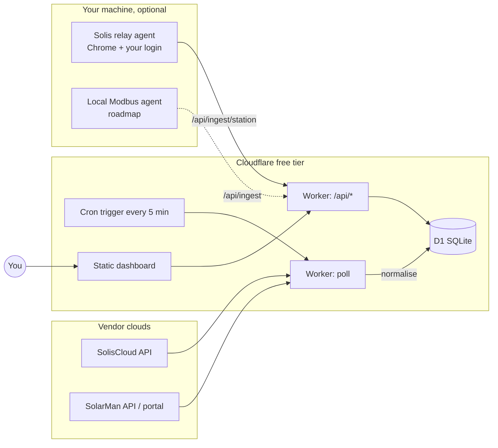

# SolarLens

**One screen for all your inverters.** SolarLens polls SolisCloud and SolarMan, stores every
reading in your own database, and shows both systems side by side — live power, today /
month / year / lifetime energy, grid import & export, battery state — on a page you can open
from any device. It runs entirely on Cloudflare's free tier (Workers + D1) or locally.

- **Two vendors, one model.** SolisCloud and SolarMan are normalised into the same reading shape, so the UI never cares where a number came from.
- **Your data, kept.** Every sample is stored (with the untouched vendor payload), so you get history the vendor apps don't let you keep or export.
- **Works with whatever access you have.** Official API keys are best; a browser-session fallback for SolarMan and a local relay agent for SolisCloud cover you while keys are pending.
- **Honest about freshness.** Every panel shows *when* it was last updated. A system reads **offline** the moment either the vendor says so or nothing has arrived for 15 minutes — and an offline system's live figures are zero, not whatever it managed just before it dropped.
- **Reads well in either theme.** A three-state toggle in the top-right corner follows your system, or forces light or dark; the choice is remembered and applied before first paint.
- **Labelled, not cryptic.** Every headline figure says what it is and what it covers — "Producing now", "Produced today", "Consumed today" — and each system's hero number is set against its rated size.
- **Tested.** Unit tests for every normaliser and unit conversion; Playwright end-to-end tests for the dashboard on desktop and mobile.

> Not affiliated with Ginlong/Solis or IGEN Tech/SolarMan. 

---

## Contents

1. [How it works](#how-it-works)
2. [Data sources and how each authenticates](#data-sources-and-how-each-authenticates)
3. [Quick start (≈10 minutes)](#quick-start-10-minutes)
4. [Getting credentials](#getting-credentials)
5. [SolisCloud relay agent](#soliscloud-relay-agent)
6. [Configuration reference](#configuration-reference)
7. [Local development](#local-development)
8. [Testing](#testing)
9. [Data model](#data-model)
10. [HTTP API](#http-api)
11. [Project layout](#project-layout)
12. [Troubleshooting](#troubleshooting)
13. [Security and privacy](#security-and-privacy)
14. [Changelog](CHANGELOG.md)
15. [Roadmap](#roadmap) · [Contributing](#contributing) · [License](#license)

---

## How it works



A single Cloudflare Worker does three jobs:

1. **Poller** — on a cron tick it asks each configured provider for its plants, then for each plant's live snapshot, normalises the vendor payload into one `Reading`, and inserts it (idempotently) into D1.
2. **API** — a few JSON endpoints over D1: latest reading per inverter, a time series for charts, poll health, and push endpoints for local agents.
3. **Static UI** — a dependency-free, hash-routed HTML page served from the same Worker. Five tabs, plus a per-system page they all link into:
   - **Overview** (`#/`) — three bands, each with one box per system: the energy-flow diagram, then the figure set, then that system's day curve.
   - **Power** (`#/power`) — the combined day curve (click a name in the legend to show or hide that line), then each system in a collapsible section carrying its full detail set: identity, datalogger, live power, counters, PV strings, per-phase AC, battery, diagnostics and raw telemetry.
   - **Historical Data** (`#/history`) — day by day per system: produced, consumed, imported, exported, battery in and out, peak and sample count, with a bar per day. Columns appear only where that system measures the quantity, and the page says plainly that the record begins when SolarLens started collecting rather than when the array was installed.
   - **Alerts** (`#/alerts`) — everything either cloud says is wrong, one collapsible section per system. Nothing is invented: each row names the field it came from, so an empty section reads as "both vendors report normal" rather than "nobody looked". The tab carries a count badge.
   - **Devices** (`#/devices`) — hardware inventory: inverters and dataloggers with serial, model, firmware, rated power, signal strength and last contact.
   - **System detail** (`#/system/<id>`) — identity and hardware, datalogger and link, live power, energy counters, per-MPPT-string PV power, battery (hybrid only), diagnostics, and a searchable raw-telemetry table.

   There is no Energy flow tab: the diagrams lead the overview instead, and an old `#/flow` bookmark lands there.

Every provider is an adapter behind one interface (`listPlants → listInverters → getReading`). A provider is active purely when its secrets are present, so the same deploy works with one vendor today and both tomorrow.

## Data sources and how each authenticates

| Route | Vendor | How it authenticates | Stability | When to use |
|---|---|---|---|---|
| **Official API** | SolisCloud | HMAC-SHA1-signed requests with `KeyId`/`KeySecret` | Documented, stable | Always, once Solis enables API access on your account |
| **Official Business API** | SolarMan | `appId`/`appSecret` + email + sha256(password) → bearer token (~2 months, auto-renewed) | Documented, stable | Always, once SolarMan issues your keys |
| **Web-session fallback** | SolarMan | Refresh token copied once from your browser; the Worker renews the 24 h access token itself | Unofficial; works until you log out or the portal changes | While waiting for keys |
| **Relay agent** | SolisCloud | Your logged-in Chrome session on your machine; the real portal makes the calls, the agent relays the responses | Unofficial; robust to portal releases, needs your PC on | While waiting for API access |
| Local Modbus | either | Direct LAN read of the datalogger | Planned | Second-by-second data, cloud-independent |

Why the difference between the two fallbacks: SolarMan's portal uses a plain bearer token that can be replayed from anywhere. SolisCloud's portal signs every call with a secret hidden in its JavaScript, so a copied token cannot be reused — the relay agent lets the portal itself do the signing instead. Details in [docs/api-notes.md](docs/api-notes.md).

## Quick start (≈10 minutes)

**Prerequisites:** Node.js 20+, a free [Cloudflare account](https://dash.cloudflare.com/sign-up), and Git.

```bash
git clone https://github.com/<you>/SolarLens.git
cd SolarLens
npm install
```

**1. Log in to Cloudflare and create the database**

```bash
npx wrangler login
npx wrangler d1 create solar-lens
```

Paste the printed `database_id` into `wrangler.jsonc` (keep the binding name `DB`), then apply the schema:

```bash
npm run db:remote
```

**2. Set your secrets** — each command prompts for the value; nothing is stored in the repo.

```bash
npx wrangler secret put API_TOKEN       # gates the dashboard and /api/*
npx wrangler secret put INGEST_TOKEN    # gates the push endpoints used by local agents
```

Generate strong tokens with:

```bash
node -e "console.log(require('crypto').randomBytes(24).toString('base64url'))"
```

Then add whichever provider credentials you have (see [Getting credentials](#getting-credentials)):

```bash
npx wrangler secret put SOLIS_KEY_ID
npx wrangler secret put SOLIS_KEY_SECRET
# and/or
npx wrangler secret put SOLARMAN_APP_ID
npx wrangler secret put SOLARMAN_APP_SECRET
npx wrangler secret put SOLARMAN_EMAIL
npx wrangler secret put SOLARMAN_PASSWORD_SHA256
# or the SolarMan browser-session fallback
npx wrangler secret put SOLARMAN_WEB_REFRESH_TOKEN
```

**3. Deploy**

```bash
npm run deploy
```

The first deploy asks you to register a `workers.dev` subdomain (a one-time name for your account); pick one and run the deploy again. It prints your URL, e.g. `https://solar-lens.<your-subdomain>.workers.dev`.

**4. Open the dashboard**

Visit `https://solar-lens.<your-subdomain>.workers.dev/auth?t=<API_TOKEN>` once on each device. That sets an `HttpOnly` cookie; from then on the plain URL just opens. The first data arrives on the next 5-minute cron tick, or immediately with:

```bash
curl -X POST -H "Authorization: Bearer <API_TOKEN>" https://solar-lens.<your-subdomain>.workers.dev/api/poll
```

> **Windows PowerShell:** `&&` is not a statement separator there — run chained commands on separate lines.

## Getting credentials

### SolisCloud (official API key)

1. In the SolisCloud web portal, check **avatar → Basic Settings** for an **API Management** section. If it is there: **Activate Now** → solve the puzzle → enter the emailed code → copy `KeyId` and `KeySecret`.
2. If it is **not** there, API access is not yet enabled on your account. Open the [Solis Service Center → Submit a ticket](https://solis-service.solisinverters.com/en/support/tickets/new), choose the **Service Support Ticket** form and fill it with:
   - Product Type **Monitoring Platform**, Product Name **Solis Cloud Web**
   - Tickets Type **API Request - System Owner** (this is the "API Access Request" the guide refers to)
   - your plant ID, country, and your SolisCloud login email as the *API Account Email Address*
   - a short description: read-only monitoring for a personal dashboard, system owner, no remote control needed.
3. Once approved, API Management appears under Basic Settings. Only end users (not installers) are eligible.

Response times vary widely — use the [relay agent](#soliscloud-relay-agent) in the meantime.

### SolarMan (official Business API)

Email `service@solarmanpv.com` asking for Business API `appId`/`appSecret`. Include your SolarMan login email, your station ID, that you are the system owner (not an installer/distributor), that you need read-only monitoring for a personal dashboard, and expected usage (one request every ~5 minutes). Replies usually take a day or two.

`SOLARMAN_PASSWORD_SHA256` is the SHA-256 hex of your SolarMan password:

```bash
node -e "console.log(require('crypto').createHash('sha256').update(process.argv[1]).digest('hex'))" 'your-password'
```

### SolarMan (browser-session fallback)

1. Log in at `https://home.solarmanpv.com` in Chrome.
2. Press F12 → **Application** → **Cookies** → `https://home.solarmanpv.com`.
3. Two cookies hold JWTs (`eyJ…`). The **persistent** one (expiry months away, ~940 bytes) is the **refresh token** — copy its value into `SOLARMAN_WEB_REFRESH_TOKEN`. The **Session** one (~880 bytes) is the access token; optionally copy it into `SOLARMAN_WEB_ACCESS_TOKEN` so the very first poll needs no refresh.
4. Do not log out of SolarMan in that browser — logging out revokes the tokens.

Password login is deliberately *not* automated: the portal requires a Cloudflare Turnstile token with every password grant, and that is a human step.

## SolisCloud relay agent

While Solis has not enabled API access on your account, run this on any machine with Google Chrome:

```bash
SOLARLENS_URL=https://solar-lens.<your-subdomain>.workers.dev INGEST_TOKEN=<INGEST_TOKEN> npm run relay:solis
```

(PowerShell: set `$env:SOLARLENS_URL = "…"` and `$env:INGEST_TOKEN = "…"` first.)

- The first run opens a Chrome window on the SolisCloud login page. Sign in once; the session is kept in `./.relay-profile` (gitignored) so later runs — including headless ones with `RELAY_HEADLESS=1` — need no interaction.
- Every 5 minutes (`RELAY_INTERVAL_MIN`) it opens each plant page, waits for the portal's own `detailMix` response, and POSTs it to `/api/ingest/station`. The Worker normalises it with the **same code path** as the cloud poller, so field mapping and sign conventions can never drift between the two routes.
- Set `SOLIS_PLANT_IDS` to limit it to specific plants; otherwise it relays every plant on the account.
- Readings arrive tagged `source: soliscloud-relay`; the dashboard shows "via soliscloud-relay" under the panel.

To keep it running: Windows Task Scheduler ("At log on", run `node agent\solis-relay.mjs` in the repo folder with the env vars set), `pm2 start agent/solis-relay.mjs --name solis-relay`, or a `systemd --user` unit on Linux.

## Configuration reference

Secrets go in with `npx wrangler secret put NAME` (production) or in `.dev.vars` (local, gitignored — copy from `.dev.vars.example`).

| Name | Required | Purpose |
|---|---|---|
| `API_TOKEN` | yes | Gates `/api/*` and the dashboard cookie. Without it the API is open (local dev only). |
| `INGEST_TOKEN` | for agents | Gates `/api/ingest` and `/api/ingest/station`. |
| `SOLIS_KEY_ID`, `SOLIS_KEY_SECRET` | Solis official | From SolisCloud API Management. |
| `SOLARMAN_APP_ID`, `SOLARMAN_APP_SECRET`, `SOLARMAN_EMAIL`, `SOLARMAN_PASSWORD_SHA256` | SolarMan official | From SolarMan support + your login. |
| `SOLARMAN_WEB_REFRESH_TOKEN`, `SOLARMAN_WEB_ACCESS_TOKEN` | SolarMan fallback | Used only when the official keys are absent. |
| `INCLUDE_PLANTS` | optional | Comma-separated vendor plant/station ids to poll. Unset = every plant visible to the accounts, including plants shared into them. |

## Local development

```bash
cp .dev.vars.example .dev.vars   # fill in what you have
npm run db:local                 # schema into the local D1
npm run dev                      # http://localhost:8787
```

`npm run seed:local` inserts a day of synthetic readings so the UI has something to draw without any credentials. With `wrangler dev` running, trigger the cron handler by hand at `http://localhost:8787/__scheduled`, then inspect rows with `npx wrangler d1 execute solar-lens --local --command "SELECT * FROM readings ORDER BY ts DESC LIMIT 5"`.

`npm run probe:solis` signs and sends a single `userStationList` request with the keys in `.dev.vars` and prints the raw response — the fastest way to confirm your Solis key works before it goes near the cron.

## Testing

```bash
npm test                    # typecheck + unit + e2e — the whole gate
npm run typecheck           # tsc over src/ and tests/
npm run test:unit           # vitest
npm run test:unit:coverage  # vitest + v8 coverage, enforces thresholds
npm run test:e2e            # playwright (add --ui for the inspector)
```

**86 unit tests** and **150 end-to-end tests** (75 specs across a desktop and a mobile project), all runnable on a laptop with no Cloudflare account, no database and no vendor credentials.

### The frameworks, and why each

| Layer | Tool | Runs against | Why not the other one |
|---|---|---|---|
| Types | `tsc`, two projects | `src/` and `tests/` | Catches shape drift before a test can even start. The specs import the Worker's own `Reading` and `Metrics`, so changing a field breaks compilation rather than one assertion in the browser. |
| Unit | Vitest | Pure modules: unit scaling, both vendor normalisers, the call queue, the weather lookup | Fast, no browser. These are the parts where a wrong answer is silent — a sign convention or a `kW`/`W` slip looks perfectly plausible on screen. |
| End-to-end | Playwright | The real `public/index.html`, served statically, with `/api/*` stubbed | The UI is a single dependency-free file with no components to unit-test. What matters is what a person sees, so that is what is asserted. |

### Unit tests — `tests/unit/`

Seven files, one concern each. They are all pure-function tests against fixtures shaped like real vendor payloads: no network, no clock, no database.

- **`units.test.ts`** — the paired value/unit fields the vendors use (`power` + `powerStr`), `kWp`/`MWh` scaling, numeric strings, and epoch milliseconds vs seconds. A missing unit means watts rather than an invented factor.
- **`normalize.test.ts`** — both vendor normalisers end to end: SolisCloud's signed-API and relay payloads, SolarMan's station snapshot and `v3/detail` register categories. This is where the conventions are pinned down — `grid_power_w` positive on import, `battery_power_w` positive on charge, under 50 W of battery drift reading as idle, an on-grid plant getting no battery at all, and the state/status mappings for both clouds.
- **`queue.test.ts`** — the rate limiter that stands between a cron run and a SolisCloud ban: calls stay in order, the minimum gap is a floor, and one failed call does not strand the ones behind it.
- **`history.test.ts`** — the day-curve backfill: the shapes the chart payload has been seen in, epoch-ms/epoch-s/datetime timestamps, trailing zero padding trimmed but an interior zero kept, and rows missing either half skipped rather than guessed at.
- **`logging.test.ts`** — what is cut out of a vendor error before it is persisted, and just as importantly that an ordinary log line passes through untouched.
- **`pii.test.ts`** — what gets stripped from a stored payload and, just as important, what does not: `capacity` merely contains the letters of `city`.

### End-to-end tests — `tests/e2e/`

One spec file of 75 tests, run twice: **chrome** (Desktop Chrome) and **mobile** (Pixel 7). `scripts/serve-static.mjs` serves `public/` and every `/api/*` route is fulfilled from fixtures in the spec, so a run takes about a minute and needs nothing external. They use the Google Chrome already on the machine (`channel: 'chrome'`); drop that line in `playwright.config.ts` for Playwright's bundled Chromium.

They assert what a person sees, grouped by what it is for: the overview and its layout at both widths, the theme toggle (including that the choice is applied before first paint), the labelled header totals, the energy-flow diagram (structure, direction from the signs, wire thickness tracking power, per-diagram marker ids), the battery panel and the derived cycle count, offline handling and zeroed figures, the Alerts tab, the collapsible Power sections and the clickable chart legend, the device inventory, raw telemetry filtering, and the token-gate guidance.

One retry is allowed locally (two on CI): the suite drives two real Chrome projects in parallel and a page load occasionally overruns the timeout on a loaded laptop. A genuine break still fails twice.

### Coverage

`npm run test:unit:coverage` writes a terminal summary plus `coverage/index.html` (and `lcov.info` for CI tooling), and fails the run if it drops below the thresholds in `vitest.config.ts`.

| Scope | Statements | Branches | Functions | Lines |
|---|---|---|---|---|
| `src/providers/` | **60%** | **52%** | **51%** | **60%** |
| `units.ts` | 96% | 97% | 100% | 100% |
| `weather.ts` | 95% | 83% | 100% | 98% |
| `queue.ts` | 100% | 100% | 100% | 100% |

The thresholds sit just under those figures, so a regression trips them and ordinary refactoring does not. **Raise them when you add tests; never lower them to turn a red build green.**

The gap to 100% is almost entirely the vendor HTTP clients — request signing, paging, token refresh — which need a live endpoint or a large mock to exercise, and which the normalisers behind them are already tested against. `src/index.ts` and `src/poll.ts` are excluded outright: they are Worker wiring (request routing, cron fan-out) covered end-to-end instead, and counting them would report a low number for code that is deliberately tested elsewhere.

Request signing itself (`crypto.subtle` MD5 + HMAC) only runs in the Workers runtime, so it is verified against the live API by `npm run probe:solis`.

## Data model

Five tables in D1 (`migrations/`), plus a poll log:

- **`inverters`** — one row per monitored unit: `id` (`{provider}:{vendor_id}` or `{provider}:station:{plant_id}` when the plant is the unit), `provider`, `serial`, `name`, `plant_id`, `plant_name`, `capacity_w`, `display_order`, `enabled`, `first_seen`, `last_seen`.
- **`readings`** — one row per sample, keyed on `(inverter_id, ts, source)`: `ac_power_w`, `dc_power_w`, `today_kwh`, `total_kwh`, `battery_soc`, `battery_power_w`, `grid_power_w`, `load_power_w`, `temp_c`, `status`, `raw` (untouched vendor JSON), and `metrics` — a JSON object with the extended figures the vendor apps show: generation by month/year/lifetime, consumption, self-consumption, grid import/export today and lifetime, battery charge/discharge today and lifetime, full-load hours, today's weather, and grid/battery status strings. Re-polling a vendor that has not produced a new sample stores no new row — but it does refresh that row's derived columns, so an improvement to a normaliser reaches the newest sample instead of waiting for the vendor to produce a fresh timestamp.
- **`devices`** — hardware behind the readings: `kind` (`inverter` / `datalogger` / `battery` / `meter`), `sn`, `model`, `firmware`, `rated_power_w`, `status`, `signal_dbm` (datalogger RSSI), `upload_cycle_s`, `commissioned_at`, `warranty_until`, `last_seen`, `strings` — a JSON array of per-MPPT-string DC power — and `battery`, a JSON record of the pack: temperature, voltage, current, BMS figures and limits, nameplate capacity, nominal voltage and chemistry. Filled by the relay agent; the vendor payload is stripped of address, coordinates and account identifiers before storage.
- **`kv`** — a small expiring key/value shelf (`k`, `v`, `expires_at`), used by the weather cache.
- **`tokens`** — cached bearer/refresh tokens per provider. **`poll_log`** — one line per poll with success and detail, surfaced in the dashboard footer.

Neither cloud reports a battery cycle counter, so the detail view derives one — lifetime charge energy over the pack's usable capacity — and labels it `derived` rather than presenting it as a vendor figure.

Conventions: power in **W**, energy in **kWh**, timestamps in **epoch seconds**; `grid_power_w` is **+ import / − export**; `battery_power_w` is **+ charging / − discharging** (|x| < 50 W is shown as idle). Free-tier headroom is comfortable: two inverters every 5 minutes is ≈ 600 writes/day against D1's 100 000.

## HTTP API

| Route | Auth | Purpose |
|---|---|---|
| `GET /api/latest` | API_TOKEN | newest reading per inverter, with `metrics` |
| `GET /api/series?from=&to=` | API_TOKEN | readings in a range (≤ 31 days) |
| `GET /api/health` | API_TOKEN | recent poll log, the newest line per feed, and whether auth is disabled |
| `GET /api/history?days=&tz=` | API_TOKEN | one row per inverter per day (`tz` is the caller UTC offset in minutes) |
| `POST /api/poll` | API_TOKEN | poll all providers now |
| `POST /api/ingest` | INGEST_TOKEN | push an already-normalised reading (`{inverter, reading}`) |
| `POST /api/ingest/station` | INGEST_TOKEN | push a raw vendor station payload (`{provider, plantId, name?, capacityW?, raw}`); normalised server-side |
| `GET /api/devices` | API_TOKEN | hardware inventory |
| `POST /api/ingest/devices` | INGEST_TOKEN | push raw vendor device records (`{provider, plantId, inverters[], collectors[]}`); normalised server-side |
| `GET /auth?t=` | — | set the dashboard cookie |

Auth is a bearer header (`Authorization: Bearer …`) or the cookie set by `/auth`.

## Project layout

```
solar-lens/
├── wrangler.jsonc            Worker, D1 binding, cron, static assets
├── tsconfig.json             typecheck for src/
├── tsconfig.tests.json       typecheck for tests/ (browser + Worker types)
├── vitest.config.ts          unit test runner, coverage provider and thresholds
├── playwright.config.ts      two browser projects, static server, retries
├── migrations/               D1 schema, applied with `wrangler d1 migrations apply`
│                             (0001 base · 0002 metrics · 0003 devices · 0004 signal
│                              0005 electrical · 0006 battery · 0007 kv cache)
├── src/
│   ├── index.ts              Hono app: API routes, ingest, static UI, scheduled()
│   ├── poll.ts               builds providers from present secrets; polls; plant filter
│   ├── db.ts                 D1 queries and the Env type
│   ├── weather.ts            optional Google Weather lookup, cached per site
│   └── providers/
│       ├── types.ts          Provider / Inverter / Reading / Metrics
│       ├── units.ts          W / kWh / timestamp normalisation
│       ├── queue.ts          serialised call queue (vendor rate limits)
│       ├── soliscloud.ts     official API adapter + station normaliser
│       ├── solarman.ts       official API adapter + station normaliser
│       └── solarman-web.ts   browser-session fallback (refresh token)
├── public/index.html         the dashboard (no build step)
├── agent/solis-relay.mjs     local Chrome relay for SolisCloud
├── scripts/                  probe, seed, capture, static server for e2e
├── tests/
│   ├── unit/units.test.ts       W / kWh / timestamp scaling
│   ├── unit/normalize.test.ts   both vendor normalisers, signs and statuses
│   ├── unit/queue.test.ts       vendor rate-limit queue
│   ├── unit/history.test.ts     day-curve backfill normalisation
│   ├── unit/pii.test.ts         what is stripped from a stored payload
│   └── e2e/dashboard.spec.ts    the dashboard, desktop and mobile
├── CHANGELOG.md              release history, newest first
├── docs/api-notes.md         observed vendor field names and conventions
└── docs/feature-gaps.md      SolisCloud vs SolarMan vs SolarLens, feature by feature
```

## Troubleshooting

| Symptom | Cause / fix |
|---|---|
| Dashboard says *unauthorized* | Open `/auth?t=<API_TOKEN>` once on that device. |
| Footer: *no provider credentials configured* | No provider secrets present. Set at least one route's secrets and redeploy or `POST /api/poll`. |
| `soliscloud: HTTP 408` | Your clock is > 15 min off SolisCloud's. Fix the system clock (Workers are fine; this affects local probes/agents). |
| `soliscloud: HTTP 403/401` on official API | Key not activated, or API access not enabled on the account. Check Basic Settings → API Management. |
| `solarman: token refused` | Wrong `appId`/`appSecret`, or the password hash is not lowercase sha256 hex. |
| SolarMan panel goes stale after ~24 h | The refresh grant failed; re-copy the refresh token (you may have logged out of SolarMan). Check `GET /api/health`. |
| Relay: *session expired* | Run the relay once without `RELAY_HEADLESS=1` and log in again. |
| Deploy: *register a workers.dev subdomain* | One-time account step; follow the printed link or pick a name in the dashboard, then deploy again. |
| PowerShell: *The token '&&' is not valid* | Run the two commands on separate lines. |
| A shared plant you don't own shows up | Set `INCLUDE_PLANTS` to the ids you want. |

## Security and privacy

Headers on every response: a Content-Security-Policy that is strict about where anything may be **sent** as well as where it may come from (`connect-src 'self'`, so injected script could not exfiltrate a reading), `frame-ancestors 'none'`, `X-Content-Type-Options: nosniff` and `Referrer-Policy: no-referrer` — the last of which also stops the one-time `/auth?t=<token>` link putting the token in a `Referer`. The policy is written twice, in `src/index.ts` and `public/_headers`, because Cloudflare serves the static page from the edge without invoking the Worker; change both or neither.

Vendor errors are stripped of query strings before they reach `poll_log` — SolarMan's token endpoint takes the account's `appId` in the URL, and that log is kept for a week, served by `/api/health` and printed in the footer. No credential should travel that far because a DNS lookup failed.

The dashboard cookie is `HttpOnly`, `Secure` and `SameSite=Lax`. Read and push routes use separate tokens, so an agent key cannot read your data. Vendor payloads are stripped of the account holder's name, email and the site's coordinates before storage, and every vendor-controlled string is escaped before it reaches the page.

**With `API_TOKEN` unset the API is open.** That is deliberate for local development, and no longer silent: the Worker logs it and the dashboard shows a banner. Set the secret before pointing anything at the public URL.

One third-party request remains: the page loads its web font from Google, which sees the viewer's IP. Self-hosting it (Manrope is OFL-licensed) or dropping to the system font stack removes that.

- Nothing identifying belongs in the repo: credentials, tokens and plant ids live only in `wrangler secret`, the Cloudflare dashboard, or the gitignored `.dev.vars`. `captures/`, `.capture-profile/` and `.relay-profile/` (browser sessions) are gitignored too.
- A public `workers.dev` URL is gated by `API_TOKEN`; without it anyone could read your production data. `INGEST_TOKEN` separately gates writes from agents.
- The SolarMan portal login sends your password in clear text in the form body. The capture helper redacts it, but never paste DevTools request bodies anywhere.
- Unofficial routes reuse *your* browser session against *your* data only. Vendor terms may restrict automation; the official APIs are the durable path and everything here prefers them when their secrets are present.

## Roadmap

- [x] Worker, D1, cron, two-panel dashboard with divider
- [x] SolisCloud and SolarMan official adapters fitted to real payloads
- [x] SolarMan browser-session fallback (refresh-token based)
- [x] SolisCloud local relay agent
- [x] Extended metrics (month/year/lifetime, grid, battery, self-consumption)
- [x] Unit tests (Vitest) and e2e tests (Playwright, desktop + mobile)
- [x] Hardware inventory: Devices view, datalogger status and RSSI, per-MPPT-string PV power
- [x] Per-system detail view with searchable raw telemetry
- [x] Energy-flow diagram (PV / grid / battery / load), battery arm omitted for on-grid
- [ ] Local Modbus agent for LSW-3/LSE-3 loggers → `/api/ingest`
- [x] SolarMan device endpoints — inverter/collector list, datalogger signal and firmware
- [x] Per-string voltage & current, per-phase AC, heatsink temperature — both vendors, no API key needed

## Contributing

Issues and pull requests are welcome. Please:

- keep vendor field names and sign conventions documented in `docs/api-notes.md` when you add or change a mapping;
- add or update a fixture and a unit test for any normaliser change, and an e2e assertion for anything a person can see;
- never commit credentials, tokens, plant ids or portal captures — the `.gitignore` is set up for this, keep it that way;
- run `npm run typecheck && npm test` before opening a PR.

If you have a different inverter brand on the same SolarMan/Solis platform family (Deye, Sofar, …), a new provider is one file implementing `Provider` in `src/providers/` plus a fixture — contributions there are especially welcome.

## License

[MIT](LICENSE).
