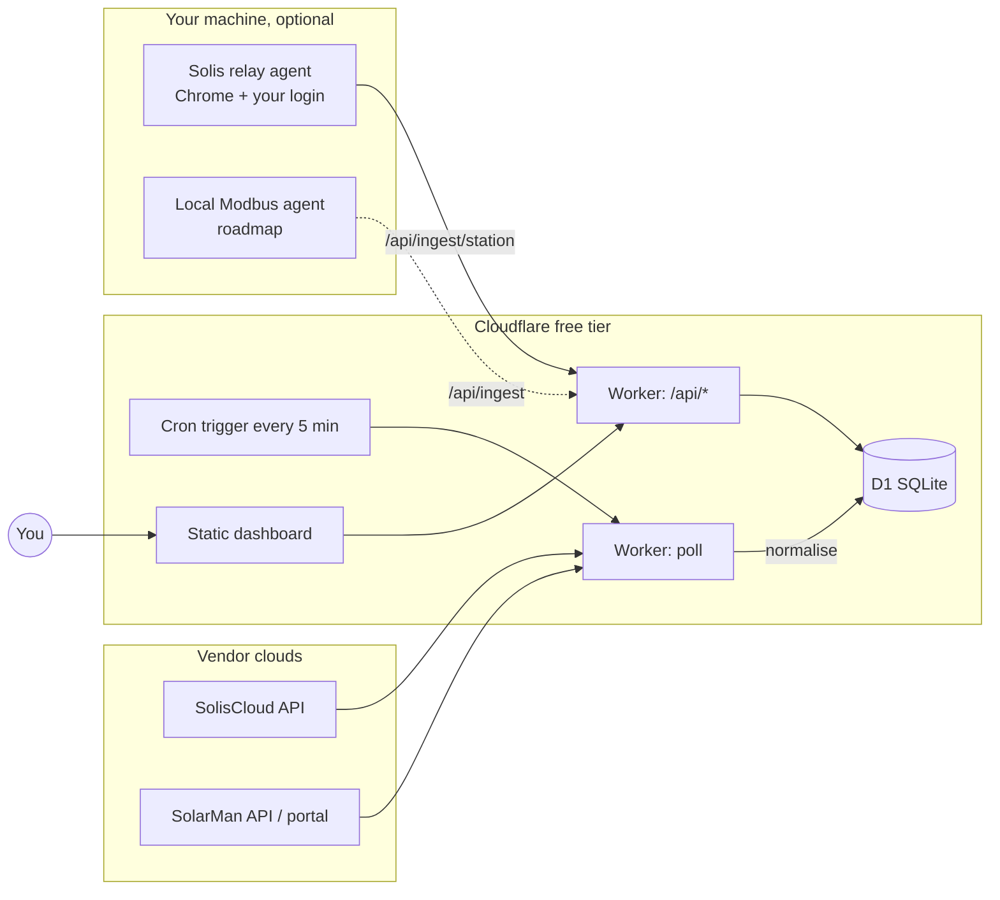

# SolarLens

**One screen for all your inverters.** SolarLens polls SolisCloud and SolarMan, stores every
reading in your own database, and shows both systems side by side — live power, today /
month / year / lifetime energy, grid import & export, battery state — on a page you can open
from any device. It runs entirely on Cloudflare's free tier (Workers + D1) or locally.

- **Two vendors, one model.** SolisCloud and SolarMan are normalised into the same reading shape, so the UI never cares where a number came from.
- **Your data, kept.** Every sample is stored (with the untouched vendor payload), so you get history the vendor apps don't let you keep or export.
- **Works with whatever access you have.** Official API keys are best; a browser-session fallback for SolarMan and a local relay agent for SolisCloud cover you while keys are pending.
- **Honest about freshness.** A panel shows *when* its number was last updated and turns amber when a feed goes quiet — no confidently stale zeros.
- **Tested.** Unit tests for every normaliser and unit conversion; Playwright end-to-end tests for the dashboard on desktop and mobile.

> Not affiliated with Ginlong/Solis or IGEN Tech/SolarMan. 

---

## Contents

1. [How it works](#how-it-works)
2. [Data sources and how each authenticates](#data-sources-and-how-each-authenticates)
3. [Quick start (≈10 minutes)](#quick-start-10-minutes)
4. [Getting credentials](#getting-credentials)
5. [SolisCloud relay agent](#soliscloud-relay-agent)
6. [Configuration reference](#configuration-reference)
7. [Local development](#local-development)
8. [Testing](#testing)
9. [Data model](#data-model)
10. [HTTP API](#http-api)
11. [Project layout](#project-layout)
12. [Troubleshooting](#troubleshooting)
13. [Security and privacy](#security-and-privacy)
14. [Roadmap](#roadmap) · [Contributing](#contributing) · [License](#license)

---

## How it works



A single Cloudflare Worker does three jobs:

1. **Poller** — on a cron tick it asks each configured provider for its plants, then for each plant's live snapshot, normalises the vendor payload into one `Reading`, and inserts it (idempotently) into D1.
2. **API** — a few JSON endpoints over D1: latest reading per inverter, a time series for charts, poll health, and push endpoints for local agents.
3. **Static UI** — a dependency-free, hash-routed HTML page served from the same Worker, with three views:
   - **Overview** (`#/`) — both systems split by a divider (stacking on phones), sparklines and a combined day chart.
   - **Devices** (`#/devices`) — hardware inventory: inverters and dataloggers with serial, model, firmware, rated power, signal strength and last contact.
   - **System detail** (`#/system/<id>`) — identity and hardware, datalogger and link, live power, energy counters, per-MPPT-string PV power, battery (hybrid only), diagnostics, and a searchable raw-telemetry table.

Every provider is an adapter behind one interface (`listPlants → listInverters → getReading`). A provider is active purely when its secrets are present, so the same deploy works with one vendor today and both tomorrow.

## Data sources and how each authenticates

| Route | Vendor | How it authenticates | Stability | When to use |
|---|---|---|---|---|
| **Official API** | SolisCloud | HMAC-SHA1-signed requests with `KeyId`/`KeySecret` | Documented, stable | Always, once Solis enables API access on your account |
| **Official Business API** | SolarMan | `appId`/`appSecret` + email + sha256(password) → bearer token (~2 months, auto-renewed) | Documented, stable | Always, once SolarMan issues your keys |
| **Web-session fallback** | SolarMan | Refresh token copied once from your browser; the Worker renews the 24 h access token itself | Unofficial; works until you log out or the portal changes | While waiting for keys |
| **Relay agent** | SolisCloud | Your logged-in Chrome session on your machine; the real portal makes the calls, the agent relays the responses | Unofficial; robust to portal releases, needs your PC on | While waiting for API access |
| Local Modbus | either | Direct LAN read of the datalogger | Planned | Second-by-second data, cloud-independent |

Why the difference between the two fallbacks: SolarMan's portal uses a plain bearer token that can be replayed from anywhere. SolisCloud's portal signs every call with a secret hidden in its JavaScript, so a copied token cannot be reused — the relay agent lets the portal itself do the signing instead. Details in [docs/api-notes.md](docs/api-notes.md).

## Quick start (≈10 minutes)

**Prerequisites:** Node.js 20+, a free [Cloudflare account](https://dash.cloudflare.com/sign-up), and Git.

```bash
git clone https://github.com/<you>/SolarLens.git
cd SolarLens
npm install
```

**1. Log in to Cloudflare and create the database**

```bash
npx wrangler login
npx wrangler d1 create solar-lens
```

Paste the printed `database_id` into `wrangler.jsonc` (keep the binding name `DB`), then apply the schema:

```bash
npm run db:remote
```

**2. Set your secrets** — each command prompts for the value; nothing is stored in the repo.

```bash
npx wrangler secret put API_TOKEN       # gates the dashboard and /api/*
npx wrangler secret put INGEST_TOKEN    # gates the push endpoints used by local agents
```

Generate strong tokens with:

```bash
node -e "console.log(require('crypto').randomBytes(24).toString('base64url'))"
```

Then add whichever provider credentials you have (see [Getting credentials](#getting-credentials)):

```bash
npx wrangler secret put SOLIS_KEY_ID
npx wrangler secret put SOLIS_KEY_SECRET
# and/or
npx wrangler secret put SOLARMAN_APP_ID
npx wrangler secret put SOLARMAN_APP_SECRET
npx wrangler secret put SOLARMAN_EMAIL
npx wrangler secret put SOLARMAN_PASSWORD_SHA256
# or the SolarMan browser-session fallback
npx wrangler secret put SOLARMAN_WEB_REFRESH_TOKEN
```

**3. Deploy**

```bash
npm run deploy
```

The first deploy asks you to register a `workers.dev` subdomain (a one-time name for your account); pick one and run the deploy again. It prints your URL, e.g. `https://solar-lens.<your-subdomain>.workers.dev`.

**4. Open the dashboard**

Visit `https://solar-lens.<your-subdomain>.workers.dev/auth?t=<API_TOKEN>` once on each device. That sets an `HttpOnly` cookie; from then on the plain URL just opens. The first data arrives on the next 5-minute cron tick, or immediately with:

```bash
curl -X POST -H "Authorization: Bearer <API_TOKEN>" https://solar-lens.<your-subdomain>.workers.dev/api/poll
```

> **Windows PowerShell:** `&&` is not a statement separator there — run chained commands on separate lines.

## Getting credentials

### SolisCloud (official API key)

1. In the SolisCloud web portal, check **avatar → Basic Settings** for an **API Management** section. If it is there: **Activate Now** → solve the puzzle → enter the emailed code → copy `KeyId` and `KeySecret`.
2. If it is **not** there, API access is not yet enabled on your account. Open the [Solis Service Center → Submit a ticket](https://solis-service.solisinverters.com/en/support/tickets/new), choose the **Service Support Ticket** form and fill it with:
   - Product Type **Monitoring Platform**, Product Name **Solis Cloud Web**
   - Tickets Type **API Request - System Owner** (this is the "API Access Request" the guide refers to)
   - your plant ID, country, and your SolisCloud login email as the *API Account Email Address*
   - a short description: read-only monitoring for a personal dashboard, system owner, no remote control needed.
3. Once approved, API Management appears under Basic Settings. Only end users (not installers) are eligible.

Response times vary widely — use the [relay agent](#soliscloud-relay-agent) in the meantime.

### SolarMan (official Business API)

Email `service@solarmanpv.com` asking for Business API `appId`/`appSecret`. Include your SolarMan login email, your station ID, that you are the system owner (not an installer/distributor), that you need read-only monitoring for a personal dashboard, and expected usage (one request every ~5 minutes). Replies usually take a day or two.

`SOLARMAN_PASSWORD_SHA256` is the SHA-256 hex of your SolarMan password:

```bash
node -e "console.log(require('crypto').createHash('sha256').update(process.argv[1]).digest('hex'))" 'your-password'
```

### SolarMan (browser-session fallback)

1. Log in at `https://home.solarmanpv.com` in Chrome.
2. Press F12 → **Application** → **Cookies** → `https://home.solarmanpv.com`.
3. Two cookies hold JWTs (`eyJ…`). The **persistent** one (expiry months away, ~940 bytes) is the **refresh token** — copy its value into `SOLARMAN_WEB_REFRESH_TOKEN`. The **Session** one (~880 bytes) is the access token; optionally copy it into `SOLARMAN_WEB_ACCESS_TOKEN` so the very first poll needs no refresh.
4. Do not log out of SolarMan in that browser — logging out revokes the tokens.

Password login is deliberately *not* automated: the portal requires a Cloudflare Turnstile token with every password grant, and that is a human step.

## SolisCloud relay agent

While Solis has not enabled API access on your account, run this on any machine with Google Chrome:

```bash
SOLARLENS_URL=https://solar-lens.<your-subdomain>.workers.dev INGEST_TOKEN=<INGEST_TOKEN> npm run relay:solis
```

(PowerShell: set `$env:SOLARLENS_URL = "…"` and `$env:INGEST_TOKEN = "…"` first.)

- The first run opens a Chrome window on the SolisCloud login page. Sign in once; the session is kept in `./.relay-profile` (gitignored) so later runs — including headless ones with `RELAY_HEADLESS=1` — need no interaction.
- Every 5 minutes (`RELAY_INTERVAL_MIN`) it opens each plant page, waits for the portal's own `detailMix` response, and POSTs it to `/api/ingest/station`. The Worker normalises it with the **same code path** as the cloud poller, so field mapping and sign conventions can never drift between the two routes.
- Set `SOLIS_PLANT_IDS` to limit it to specific plants; otherwise it relays every plant on the account.
- Readings arrive tagged `source: soliscloud-relay`; the dashboard shows "via soliscloud-relay" under the panel.

To keep it running: Windows Task Scheduler ("At log on", run `node agent\solis-relay.mjs` in the repo folder with the env vars set), `pm2 start agent/solis-relay.mjs --name solis-relay`, or a `systemd --user` unit on Linux.

## Configuration reference

Secrets go in with `npx wrangler secret put NAME` (production) or in `.dev.vars` (local, gitignored — copy from `.dev.vars.example`).

| Name | Required | Purpose |
|---|---|---|
| `API_TOKEN` | yes | Gates `/api/*` and the dashboard cookie. Without it the API is open (local dev only). |
| `INGEST_TOKEN` | for agents | Gates `/api/ingest` and `/api/ingest/station`. |
| `SOLIS_KEY_ID`, `SOLIS_KEY_SECRET` | Solis official | From SolisCloud API Management. |
| `SOLARMAN_APP_ID`, `SOLARMAN_APP_SECRET`, `SOLARMAN_EMAIL`, `SOLARMAN_PASSWORD_SHA256` | SolarMan official | From SolarMan support + your login. |
| `SOLARMAN_WEB_REFRESH_TOKEN`, `SOLARMAN_WEB_ACCESS_TOKEN` | SolarMan fallback | Used only when the official keys are absent. |
| `INCLUDE_PLANTS` | optional | Comma-separated vendor plant/station ids to poll. Unset = every plant visible to the accounts, including plants shared into them. |

Cron cadence and the D1 binding live in `wrangler.jsonc`. Five minutes matches how often the vendors themselves refresh; faster polling buys nothing but rate-limit risk (SolisCloud allows 3 calls per 5 s per IP).

## Local development

```bash
cp .dev.vars.example .dev.vars   # fill in what you have
npm run db:local                 # schema into the local D1
npm run dev                      # http://localhost:8787
```

`npm run seed:local` inserts a day of synthetic readings so the UI has something to draw without any credentials. With `wrangler dev` running, trigger the cron handler by hand at `http://localhost:8787/__scheduled`, then inspect rows with `npx wrangler d1 execute solar-lens --local --command "SELECT * FROM readings ORDER BY ts DESC LIMIT 5"`.

`npm run probe:solis` signs and sends a single `userStationList` request with the keys in `.dev.vars` and prints the raw response — the fastest way to confirm your Solis key works before it goes near the cron.

## Testing

```bash
npm test              # unit + e2e
npm run test:unit     # vitest
npm run test:e2e      # playwright (add --ui for the inspector)
```

- **Unit tests** (`tests/unit/`, Vitest) cover unit scaling (`toWatts`/`toKwh` incl. `kWp`, `MWh`), timestamp handling (ms vs s), and both vendor normalisers against fixtures that mirror real payload shapes — including the grid and battery sign conventions and the state/status mappings.
- **End-to-end tests** (`tests/e2e/`, Playwright, TypeScript) load the real dashboard from a tiny static server and stub `/api/*`, so they run in seconds with no Cloudflare, D1 or vendor credentials. They assert what a person sees: both panels with the right numbers, the divider layout (side by side on desktop, stacked on a Pixel 7), the expandable energy breakdown, staleness flags, failed-poll reporting and the token-gate guidance. They use the Google Chrome already on the machine (`channel: 'chrome'`); remove that line in `playwright.config.ts` to use Playwright's bundled Chromium instead.
- Tests are TypeScript on purpose: they import the same `Reading` and `Metrics` types the Worker uses, so a change to the data shape fails at compile time rather than silently in the browser.

Signing itself (`crypto.subtle` MD5 + HMAC) runs only in the Workers runtime and is verified by `npm run probe:solis`.

## Data model

Four tables in D1 (`migrations/`):

- **`inverters`** — one row per monitored unit: `id` (`{provider}:{vendor_id}` or `{provider}:station:{plant_id}` when the plant is the unit), `provider`, `serial`, `name`, `plant_id`, `plant_name`, `capacity_w`, `display_order`, `enabled`, `first_seen`, `last_seen`.
- **`readings`** — one row per sample, keyed on `(inverter_id, ts, source)`: `ac_power_w`, `dc_power_w`, `today_kwh`, `total_kwh`, `battery_soc`, `battery_power_w`, `grid_power_w`, `load_power_w`, `temp_c`, `status`, `raw` (untouched vendor JSON), and `metrics` — a JSON object with the extended figures the vendor apps show: generation by month/year/lifetime, consumption, self-consumption, grid import/export today and lifetime, battery charge/discharge today and lifetime, and grid/battery status strings. Re-polling a vendor that has not produced a new sample is a no-op, not a duplicate.
- **`devices`** — hardware behind the readings: `kind` (`inverter` / `datalogger` / `battery` / `meter`), `sn`, `model`, `firmware`, `rated_power_w`, `status`, `signal_dbm` (datalogger RSSI), `upload_cycle_s`, `commissioned_at`, `warranty_until`, `last_seen`, and `strings` — a JSON array of per-MPPT-string DC power. Filled by the relay agent; the vendor payload is stripped of address, coordinates and account identifiers before storage.
- **`tokens`** — cached bearer/refresh tokens per provider. **`poll_log`** — one line per poll with success and detail, surfaced in the dashboard footer.

Conventions: power in **W**, energy in **kWh**, timestamps in **epoch seconds**; `grid_power_w` is **+ import / − export**; `battery_power_w` is **+ charging / − discharging** (|x| < 50 W is shown as idle). Free-tier headroom is comfortable: two inverters every 5 minutes is ≈ 600 writes/day against D1's 100 000.

## HTTP API

| Route | Auth | Purpose |
|---|---|---|
| `GET /api/latest` | API_TOKEN | newest reading per inverter, with `metrics` |
| `GET /api/series?from=&to=` | API_TOKEN | readings in a range (≤ 31 days) |
| `GET /api/health` | API_TOKEN | recent poll log |
| `POST /api/poll` | API_TOKEN | poll all providers now |
| `POST /api/ingest` | INGEST_TOKEN | push an already-normalised reading (`{inverter, reading}`) |
| `POST /api/ingest/station` | INGEST_TOKEN | push a raw vendor station payload (`{provider, plantId, name?, capacityW?, raw}`); normalised server-side |
| `GET /api/devices` | API_TOKEN | hardware inventory |
| `POST /api/ingest/devices` | INGEST_TOKEN | push raw vendor device records (`{provider, plantId, inverters[], collectors[]}`); normalised server-side |
| `GET /auth?t=` | — | set the dashboard cookie |

Auth is a bearer header (`Authorization: Bearer …`) or the cookie set by `/auth`.

## Project layout

```
solar-lens/
├── wrangler.jsonc            Worker, D1 binding, cron, static assets
├── migrations/               D1 schema (0001 base, 0002 metrics, 0003 devices)
├── src/
│   ├── index.ts              Hono app: API routes, ingest, static UI, scheduled()
│   ├── poll.ts               builds providers from present secrets; polls; plant filter
│   ├── db.ts                 D1 queries and the Env type
│   └── providers/
│       ├── types.ts          Provider / Inverter / Reading / Metrics
│       ├── units.ts          W / kWh / timestamp normalisation
│       ├── queue.ts          serialised call queue (vendor rate limits)
│       ├── soliscloud.ts     official API adapter + station normaliser
│       ├── solarman.ts       official API adapter + station normaliser
│       └── solarman-web.ts   browser-session fallback (refresh token)
├── public/index.html         the dashboard (no build step)
├── agent/solis-relay.mjs     local Chrome relay for SolisCloud
├── scripts/                  probe, seed, capture, static server for e2e
├── tests/                    unit (vitest), e2e (playwright), fixtures
├── docs/api-notes.md         observed vendor field names and conventions
└── docs/feature-gaps.md      SolisCloud vs SolarMan vs SolarLens, feature by feature
```

## Troubleshooting

| Symptom | Cause / fix |
|---|---|
| Dashboard says *unauthorized* | Open `/auth?t=<API_TOKEN>` once on that device. |
| Footer: *no provider credentials configured* | No provider secrets present. Set at least one route's secrets and redeploy or `POST /api/poll`. |
| `soliscloud: HTTP 408` | Your clock is > 15 min off SolisCloud's. Fix the system clock (Workers are fine; this affects local probes/agents). |
| `soliscloud: HTTP 403/401` on official API | Key not activated, or API access not enabled on the account. Check Basic Settings → API Management. |
| `solarman: token refused` | Wrong `appId`/`appSecret`, or the password hash is not lowercase sha256 hex. |
| SolarMan panel goes stale after ~24 h | The refresh grant failed; re-copy the refresh token (you may have logged out of SolarMan). Check `GET /api/health`. |
| Relay: *session expired* | Run the relay once without `RELAY_HEADLESS=1` and log in again. |
| Deploy: *register a workers.dev subdomain* | One-time account step; follow the printed link or pick a name in the dashboard, then deploy again. |
| PowerShell: *The token '&&' is not valid* | Run the two commands on separate lines. |
| A shared plant you don't own shows up | Set `INCLUDE_PLANTS` to the ids you want. |

## Security and privacy

- Nothing identifying belongs in the repo: credentials, tokens and plant ids live only in `wrangler secret`, the Cloudflare dashboard, or the gitignored `.dev.vars`. `captures/`, `.capture-profile/` and `.relay-profile/` (browser sessions) are gitignored too.
- A public `workers.dev` URL is gated by `API_TOKEN`; without it anyone could read your production data. `INGEST_TOKEN` separately gates writes from agents.
- The SolarMan portal login sends your password in clear text in the form body. The capture helper redacts it, but never paste DevTools request bodies anywhere.
- Unofficial routes reuse *your* browser session against *your* data only. Vendor terms may restrict automation; the official APIs are the durable path and everything here prefers them when their secrets are present.

## Roadmap

- [x] Worker, D1, cron, two-panel dashboard with divider
- [x] SolisCloud and SolarMan official adapters fitted to real payloads
- [x] SolarMan browser-session fallback (refresh-token based)
- [x] SolisCloud local relay agent
- [x] Extended metrics (month/year/lifetime, grid, battery, self-consumption)
- [x] Unit tests (Vitest) and e2e tests (Playwright, desktop + mobile)
- [x] Hardware inventory: Devices view, datalogger status and RSSI, per-MPPT-string PV power
- [x] Per-system detail view with searchable raw telemetry
- [ ] Local Modbus agent for LSW-3/LSE-3 loggers → `/api/ingest`
- [x] SolarMan device endpoints — inverter/collector list, datalogger signal and firmware
- [x] Per-string voltage & current, per-phase AC, heatsink temperature — via the relay, no API key needed

## Contributing

Issues and pull requests are welcome. Please:

- keep vendor field names and sign conventions documented in `docs/api-notes.md` when you add or change a mapping;
- add or update a fixture and a unit test for any normaliser change, and an e2e assertion for anything a person can see;
- never commit credentials, tokens, plant ids or portal captures — the `.gitignore` is set up for this, keep it that way;
- run `npm run typecheck && npm test` before opening a PR.

If you have a different inverter brand on the same SolarMan/Solis platform family (Deye, Sofar, …), a new provider is one file implementing `Provider` in `src/providers/` plus a fixture — contributions there are especially welcome.

## License

[MIT](LICENSE).
