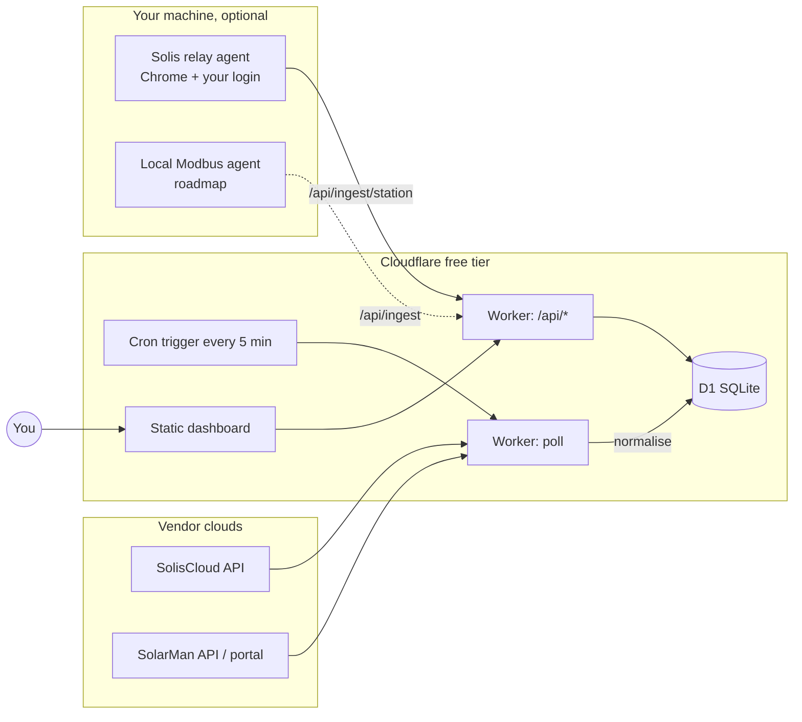

# SolarLens

**One screen for all your inverters.** SolarLens polls SolisCloud and SolarMan, stores every
reading in your own database, and shows both systems side by side — live power, today /
month / year / lifetime energy, grid import & export, battery state — on a page you can open
from any device. It runs entirely on Cloudflare's free tier (Workers + D1) or locally.

- **Two vendors, one model.** SolisCloud and SolarMan are normalised into the same reading shape, so the UI never cares where a number came from.
- **Your data, kept.** Every sample is stored (with the untouched vendor payload), so you get history the vendor apps don't let you keep or export.
- **Works with whatever access you have.** Official API keys are best; a browser-session fallback for SolarMan and a local relay agent for SolisCloud cover you while keys are pending.
- **Honest about freshness.** Every panel shows *when* it was last updated. A system reads **offline** the moment either the vendor says so or nothing has arrived for 25 minutes — and an offline system's live figures are zero, not whatever it managed just before it dropped.
- **Reads well in either theme.** A three-state toggle in the top-right corner follows your system, or forces light or dark; the choice is remembered and applied before first paint.
- **Labelled, not cryptic.** Every headline figure says what it is and what it covers — "Producing now", "Produced today", "Consumed today" — and each system's live output is set against its rated size.
- **Open it and it is there.** No login, no token to copy onto each device — the readings are public by design, with vendor identifiers stripped from every response before it leaves the Worker.
- **Tested.** Unit tests for every normaliser and unit conversion; Playwright end-to-end tests for the dashboard on desktop and mobile.

> Not affiliated with Ginlong/Solis or IGEN Tech/SolarMan. 

---

## Contents

1. [How it works](#how-it-works)
2. [Data sources and how each authenticates](#data-sources-and-how-each-authenticates)
3. [Quick start (≈10 minutes)](#quick-start-10-minutes)
4. [Getting credentials](#getting-credentials) — [SolisCloud](#soliscloud-official-api-key) · [SolarMan](#solarman-official-business-api) · [SolarMan fallback](#solarman-browser-session-fallback)
5. [SolisCloud relay agent](#soliscloud-relay-agent) — [one command on Windows](#one-command-on-windows) · [more than one machine](#running-it-on-more-than-one-machine) · [replacing a token](#replacing-a-token)
6. [Configuration reference](#configuration-reference)
7. [Local development](#local-development)
8. [Testing](#testing)
9. [Data model](#data-model)
10. [HTTP API](#http-api)
11. [Project layout](#project-layout)
12. [Troubleshooting](#troubleshooting)
13. [Security and privacy](#security-and-privacy)
14. [Changelog](CHANGELOG.md)
15. [Roadmap](#roadmap) · [Contributing](#contributing) · [License](#license)

---

## How it works



A single Cloudflare Worker does three jobs:

1. **Poller** — on a cron tick it asks each configured provider for its plants, then for each plant's live snapshot, normalises the vendor payload into one `Reading`, and inserts it (idempotently) into D1.
2. **API** — a few JSON endpoints over D1: latest reading per inverter, a time series for charts, poll health, and push endpoints for local agents.
3. **Static UI** — a dependency-free, hash-routed HTML page served from the same Worker. Five tabs, plus a per-system page they all link into:
   - **Overview** (`#/`) — one column per system, sized to fit a laptop screen without scrolling: the energy-flow diagram, then that system's figures as tiles, then its day curve. Producing now, house load, grid direction and battery charge live in the diagram and are not repeated as figures. Model and datalogger signal are not here at all — they never change, so they sit on Devices. Anything above the curve opens that system's detail page; the curve opens Power. Below 1080px wide the columns stack, and below 660px tall the page scrolls, because two systems will not fit on a phone and a very short window cannot hold a diagram, twelve figures and a readable curve at once.
   - **Power** (`#/power`) — the combined day curve (click a name in the legend to show or hide that line), then each system in a collapsible section carrying its full detail set: identity, datalogger, live power, counters, PV strings, per-phase AC, battery, diagnostics and raw telemetry.
   - **Historical Data** (`#/history`) — day by day per system: produced, consumed, imported, exported, battery in and out, peak and sample count, with a bar per day. Columns appear only where that system measures the quantity, and the page says plainly that the record begins when SolarLens started collecting rather than when the array was installed.
   - **Alerts** (`#/alerts`) — everything either cloud says is wrong, one collapsible section per system. Nothing is invented: each row names the field it came from, so an empty section reads as "both vendors report normal" rather than "nobody looked". The tab carries a count badge.
   - **Devices** (`#/devices`) — hardware inventory: inverters and dataloggers with serial, model, firmware, rated power, signal strength and last contact.
   - **System detail** (`#/system/<id>`) — identity and hardware, datalogger and link, live power, energy counters, per-MPPT-string PV power, battery (hybrid only), diagnostics, and a searchable raw-telemetry table.

   There is no Energy flow tab: the diagrams lead the overview instead, and an old `#/flow` bookmark lands there.

Every provider is an adapter behind one interface (`listPlants → listInverters → getReading`). A provider is active purely when its secrets are present, so the same deploy works with one vendor today and both tomorrow.

## Data sources and how each authenticates

| Route | Vendor | How it authenticates | Stability | When to use |
|---|---|---|---|---|
| **Official API** | SolisCloud | HMAC-SHA1-signed requests with `KeyId`/`KeySecret` | Documented, stable | Always, once Solis enables API access on your account |
| **Official Business API** | SolarMan | `appId`/`appSecret` + email + sha256(password) → bearer token (~2 months, auto-renewed) | Documented, stable | Always, once SolarMan issues your keys |
| **Web-session fallback** | SolarMan | Refresh token copied once from your browser; the Worker renews the 24 h access token itself | Unofficial; works until you log out or the portal changes | While waiting for keys |
| **Relay agent** | SolisCloud | Your logged-in Chrome session on your machine; the real portal makes the calls, the agent relays the responses | Unofficial; robust to portal releases, needs your PC on | While waiting for API access |
| Local Modbus | either | Direct LAN read of the datalogger | Planned | Second-by-second data, cloud-independent |

Why the difference between the two fallbacks: SolarMan's portal uses a plain bearer token that can be replayed from anywhere. SolisCloud's portal signs every call with a secret hidden in its JavaScript, so a copied token cannot be reused — the relay agent lets the portal itself do the signing instead. Details in [docs/api-notes.md](docs/api-notes.md).

## Quick start (≈10 minutes)

**Prerequisites:** Node.js 20+, a free [Cloudflare account](https://dash.cloudflare.com/sign-up), and Git.

```bash
git clone https://github.com/<you>/SolarLens.git
cd SolarLens
npm install
```

**1. Log in to Cloudflare and create the database**

```bash
npx wrangler login
npx wrangler d1 create solar-lens
```

That prints a `database_id`. It is not a credential — nobody can touch the
database without your Cloudflare login — but it identifies your account, so
this repository keeps it out of version control. Put it in `.dev.vars`
instead, which is gitignored:

```bash
cp .dev.vars.example .dev.vars
```

and set the line:

```
CF_D1_DATABASE_ID=<the id wrangler just printed>
```

`wrangler.jsonc` carries the placeholder `${CF_D1_DATABASE_ID}`, and
`scripts/wrangler.mjs` substitutes your real id into a temporary, gitignored
copy of the config each time you run a command. **Because of that, use the npm
scripts rather than `npx wrangler` directly** — `npm run cf -- <anything>`
passes any wrangler command through the wrapper:

```bash
npm run db:remote                 # apply the schema to the deployed database
npm run cf -- d1 info solar-lens  # the general escape hatch
```

**2. Set your secrets** — each command prompts for the value; nothing is stored in the repo.

```bash
npm run cf -- secret put API_TOKEN       # gates the routes that write or spend quota
npm run cf -- secret put INGEST_TOKEN    # gates the push endpoints used by local agents
```

Generate strong tokens with:

```bash
node -e "console.log(require('crypto').randomBytes(24).toString('base64url'))"
```

Keep both somewhere you can find them again — a password manager, not a file
on the machine. Cloudflare will never show a secret back to you, so a lost
token can only be replaced, not recovered (see
[Replacing a token](#replacing-a-token)). Put the same values in `.dev.vars`
as well: the relay agent and `npm run dev` read them from there.

Then add whichever provider credentials you have (see [Getting credentials](#getting-credentials)):

```bash
npm run cf -- secret put SOLIS_KEY_ID
npm run cf -- secret put SOLIS_KEY_SECRET
# and/or
npm run cf -- secret put SOLARMAN_APP_ID
npm run cf -- secret put SOLARMAN_APP_SECRET
npm run cf -- secret put SOLARMAN_EMAIL
npm run cf -- secret put SOLARMAN_PASSWORD_SHA256
# or the SolarMan browser-session fallback
npm run cf -- secret put SOLARMAN_WEB_REFRESH_TOKEN
```

If you have neither vendor's API keys yet, that is the normal starting point —
both are approvals you have to request. Skip to
[Getting credentials](#getting-credentials) for how to ask, and use the
[SolarMan browser-session fallback](#solarman-browser-session-fallback) and the
[SolisCloud relay agent](#soliscloud-relay-agent) to have real data on screen
the same day.

**3. Deploy**

```bash
npm run deploy
```

The first deploy asks you to register a `workers.dev` subdomain (a one-time name for your account); pick one and run the deploy again. It prints your URL, e.g. `https://solar-lens.<your-subdomain>.workers.dev`.

**4. Open the dashboard**

Open `https://solar-lens.<your-subdomain>.workers.dev`. That is all — on any
phone, tablet or laptop, with nothing to copy first. Readings are public by
design, with vendor identifiers stripped from every response; see
[Reads are public; writes are not](#reads-are-public-writes-are-not) for exactly
what that publishes and how to put a login in front of it if your site needs
one.

The first data arrives on the next 5-minute cron tick, or immediately with:

```bash
curl -X POST -H "Authorization: Bearer <API_TOKEN>" https://solar-lens.<your-subdomain>.workers.dev/api/poll
```

> **Windows PowerShell:** `&&` is not a statement separator there — run chained commands on separate lines.

## Getting credentials

### SolisCloud (official API key)

1. In the SolisCloud web portal, check **avatar → Basic Settings** for an **API Management** section. If it is there: **Activate Now** → solve the puzzle → enter the emailed code → copy `KeyId` and `KeySecret`.
2. If it is **not** there, API access is not yet enabled on your account. Open the [Solis Service Center → Submit a ticket](https://solis-service.solisinverters.com/en/support/tickets/new), choose the **Service Support Ticket** form and fill it with:
   - Product Type **Monitoring Platform**, Product Name **Solis Cloud Web**
   - Tickets Type **API Request - System Owner** (this is the "API Access Request" the guide refers to)
   - your plant ID, country, and your SolisCloud login email as the *API Account Email Address*
   - a short description: read-only monitoring for a personal dashboard, system owner, no remote control needed.
3. Once approved, API Management appears under Basic Settings. Only end users (not installers) are eligible.

Response times vary widely — use the [relay agent](#soliscloud-relay-agent) in the meantime.

### SolarMan (official Business API)

Email `service@solarmanpv.com` asking for Business API `appId`/`appSecret`. Include your SolarMan login email, your station ID, that you are the system owner (not an installer/distributor), that you need read-only monitoring for a personal dashboard, and expected usage (one request every ~5 minutes). Replies usually take a day or two.

`SOLARMAN_PASSWORD_SHA256` is the SHA-256 hex of your SolarMan password:

```bash
node -e "console.log(require('crypto').createHash('sha256').update(process.argv[1]).digest('hex'))" 'your-password'
```

### SolarMan (browser-session fallback)

1. Log in at `https://home.solarmanpv.com` in Chrome.
2. Press F12 → **Application** → **Cookies** → `https://home.solarmanpv.com`.
3. Two cookies hold JWTs (`eyJ…`). The **persistent** one (expiry months away, ~940 bytes) is the **refresh token** — copy its value into `SOLARMAN_WEB_REFRESH_TOKEN`. The **Session** one (~880 bytes) is the access token; optionally copy it into `SOLARMAN_WEB_ACCESS_TOKEN` so the very first poll needs no refresh.
4. Do not log out of SolarMan in that browser — logging out revokes the tokens.

Password login is deliberately *not* automated: the portal requires a Cloudflare Turnstile token with every password grant, and that is a human step.

## SolisCloud relay agent

SolarMan reaches the Worker on its own: its portal hands out an ordinary bearer
token that can be replayed from anywhere, so Cloudflare talks to SolarMan
directly and nothing of yours has to be running. SolisCloud cannot work that
way. Its portal signs every request with a secret buried in its own JavaScript,
so a copied token is worthless off the page that made it. Until Solis approves
an API key for your account, the way to get Solis data is to let the real
portal make the calls in a real browser and forward what comes back.

That is the relay agent: a small script that drives a logged-in Chrome on a
machine of yours and POSTs each response to `/api/ingest/station`. **It only
produces Solis data while that machine is awake.** SolarMan keeps updating
regardless.

### One command on Windows

Double-click **`setup-relay.cmd`**, or run it from a terminal:

```bash
setup-relay.cmd
```

It installs anything missing (Node, Git, Chrome, via winget), clones the
repository if it is not already there, asks for your Worker URL and
`INGEST_TOKEN`, walks you through one SolisCloud login, and registers a
scheduled task so the relay starts itself at every logon and keeps running
after you close the terminal.

It is safe to run twice, and a second run is how you update a machine: it pulls,
reuses the saved session, and re-registers the task. Two details it gets right
that are easy to get wrong by hand:

- **No console window.** The task starts `scripts\relay-hidden.vbs`, not
  `node.exe` directly. node is a console application, so running it from a task
  puts a black terminal on screen at every logon and leaves it there. Task
  Scheduler's *Hidden* setting does not help — that hides the task from the
  Task Scheduler list — and the S4U principal that would needs an elevated
  prompt this installer deliberately does not ask for.
- **The account name comes from Windows**, via
  `WindowsIdentity::GetCurrent().Name`, rather than being assembled from
  `COMPUTERNAME` and `USERNAME`. On a domain or Entra-joined machine the user
  resolves as `DOMAIN\name` or `AzureAD\name`, and the composed version maps to
  no SID at all — registration fails with *No mapping between account names and
  security IDs was done*.

Useful switches:

| Switch | Effect |
|---|---|
| `-InstallDir <path>` | Where to put the checkout (default `%USERPROFILE%\SolarLens`) |
| `-WorkerUrl`, `-IngestToken`, `-PlantIds` | Answer the prompts up front |
| `-NoTask` | Set everything up but do not register the scheduled task |
| `-UseMyChrome` | Attach to the Chrome you already have open instead of running a second one — see below |
| `-DebugPort <n>` | Which port `-UseMyChrome` connects on (default 9222) |

### On macOS or Linux, or by hand

```bash
git clone https://github.com/<you>/SolarLens.git && cd SolarLens && npm install
cp .dev.vars.example .dev.vars      # set SOLARLENS_URL and INGEST_TOKEN
npm run relay:solis
```

The first run opens a Chrome window on the SolisCloud login page. Sign in once;
the session is kept in `./.relay-profile` (gitignored), so later runs need no
interaction. Then set `RELAY_HEADLESS=1` in `.dev.vars` and it runs invisibly.
To keep it alive: `pm2 start agent/solis-relay.mjs --name solis-relay`, or a
`systemd --user` unit, or Windows Task Scheduler if you skipped the installer.

### How it behaves

- Every 5 minutes (`RELAY_INTERVAL_MIN`) it opens each plant page, waits for the portal's own `detailMix` response, and POSTs it. The Worker normalises it with the **same code path** as the cloud poller, so field mapping and sign conventions can never drift between the two routes.
- Set `SOLIS_PLANT_IDS` to limit it to specific plants; otherwise it relays every plant the account can see, including plants shared into it by someone else.
- Readings arrive tagged `source: soliscloud-relay`; the dashboard shows "via soliscloud-relay" under the panel.
- It reads `.dev.vars` itself, and clears its own stale Chrome profile lock if a previous run was killed.
- **It retries a failed browser launch** twice with a short backoff, and clears the `Singleton*` files Chrome leaves when a machine is shut down under it — but only when nothing holds the profile, because a live Chrome owns those files. Without this, the first cycle after a restart fails and Solis loses a whole interval: Chrome starts, exits before Playwright can speak to it, and the error is not the one a message-matching retry would recognise.
- `RELAY_ONCE=1` runs a single cycle and exits with a code that says whether it worked. The installer uses it for the sign-in step, so that step ends by itself instead of asking anyone to press Ctrl+C — which on Windows raises *Terminate batch job (Y/N)?* inside a `.cmd` and strands the installer half-finished.

### Running it on more than one machine

Encouraged, and the reason the ingest endpoint is idempotent. Run the same
setup on a second computer — a work laptop, a desktop that is on at different
hours — with the same Worker URL and `INGEST_TOKEN`. A reading that arrives
twice is stored once, and whichever machine is awake backfills the part of the
day the others missed. Two machines with complementary schedules cover far more
of the day than either alone.

`setup-relay.cmd` still stops three times to ask for the Worker URL, the ingest
token and the plant ids, which means carrying those values across and typing a
43-character token correctly. To skip that, generate a personalised installer
**on the machine that already works**:

```bash
powershell -NoProfile -ExecutionPolicy Bypass -File scripts\make-laptop-installer.ps1
```

It reads those three values out of your `.dev.vars` and writes
`setup-solarlens-relay.cmd` to your Desktop (or wherever `-OutFile` says) with
them already filled in. Copy it to the other machine and double-click it: it
installs what is missing, fetches the code, configures itself, and registers
the scheduled task without asking you anything.

The one step that stays manual is the SolisCloud login, in the browser window
it opens. That is not an omission — the relay works by driving a logged-in
browser session, and no script can type your password into a login form for
you. Everything after it is automatic, and the window closes itself.

It reaches the code three ways, in order of how reliable they proved to be:

1. **A checkout already on that machine** — used as it stands, updated with
   `git pull` when that works.
2. **`git clone` from `github.com`** — the host that stayed up while
   `raw.githubusercontent.com` was answering 503.
3. **A single file over HTTPS from `raw.githubusercontent.com`** — last resort,
   for a machine with no git at all. When that is the situation the message says
   so and names the fix, instead of blaming a busy server.

If step 1 finds a checkout that can no longer fast-forward, it is fetched and
reset to `origin/main`. That case is not exotic here: **this repository's
history has been rewritten and force-pushed**, so any clone taken beforehand
holds commits that are not ancestors of the published branch and can never pull
again. A checkout in that state would otherwise sit on stale code forever —
including a stale copy of the installer, which is how one machine ended up
unable to deliver its own fix. The reset happens **only** when `git status`
reports nothing to lose; a working tree with local modifications is left alone
with a warning.

> **The generated file contains your ingest token in plain text.** That is why
> it is written outside the repository. The token only permits pushing
> readings — it cannot read your dashboard and cannot reach your Cloudflare
> account — but carry the file on a USB stick rather than emailing it, and
> delete it from both machines once the setup is done.

### `-UseMyChrome`, and why it is not the default

By default the relay runs a Chrome of its own with its own profile. That is not
an oversight: Chrome refuses to let two programs share one profile directory, so
the agent genuinely cannot borrow the browser you are using.

`-UseMyChrome` takes the other route — it attaches over the DevTools protocol to
a Chrome you started yourself, and uses the SolisCloud login already in it. The
cost is real and worth understanding before choosing it:

- Chrome only accepts that connection if it was **started** with
  `--remote-debugging-port=9222`. The flag cannot be switched on afterwards, so
  you must close every Chrome window and relaunch it that way.
- While that port is open, any program on the machine can drive your browser and
  everything it is signed in to.
- The relay stops whenever you close Chrome.

The separate hidden browser has none of those drawbacks, which is why it is the
default. `-UseMyChrome` exists for people who would rather not have a second
browser profile at all.

### Replacing a token

Cloudflare never shows a secret back, so a token you have lost — or one that has
leaked — can only be replaced. On Windows:

```bash
powershell -NoProfile -ExecutionPolicy Bypass -File scripts\rotate-tokens.ps1 -Ingest
```

`-Ingest` sets a new `INGEST_TOKEN` in Cloudflare, writes it to `.dev.vars` and
restarts the relay. `-Api` does the same for `API_TOKEN` and prints the fresh
`/auth?t=…` link — note that it signs out every device, since the cookie *is*
the token. Cloudflare is updated first, so a failure leaves the old token
working everywhere rather than half-changed.

Elsewhere, do the same three steps by hand: `npm run cf -- secret put <NAME>`,
update `.dev.vars`, restart the relay.

## Configuration reference

Secrets go in with `npm run cf -- secret put NAME` (production) or in `.dev.vars` (local, gitignored — copy from `.dev.vars.example`).

**Read by the Worker, in Cloudflare:**

| Name | Required | Purpose |
|---|---|---|
| `API_TOKEN` | for `POST /api/poll` | Gates the routes that write or spend vendor quota. Reads are public by design. |
| `INGEST_TOKEN` | for agents | Gates `/api/ingest`, `/api/ingest/station` and `/api/ingest/history`. |
| `SOLIS_KEY_ID`, `SOLIS_KEY_SECRET` | Solis official | From SolisCloud API Management. Present = the Worker polls Solis directly and the relay becomes optional. |
| `SOLARMAN_APP_ID`, `SOLARMAN_APP_SECRET`, `SOLARMAN_EMAIL`, `SOLARMAN_PASSWORD_SHA256` | SolarMan official | From SolarMan support + your login. |
| `SOLARMAN_WEB_REFRESH_TOKEN`, `SOLARMAN_WEB_ACCESS_TOKEN` | SolarMan fallback | Used only when the official keys are absent. |
| `INCLUDE_PLANTS` | optional | Comma-separated vendor plant/station ids to poll. Unset = every plant visible to the accounts, including plants shared into them. |

**Read locally only, from `.dev.vars` — never sent to Cloudflare:**

| Name | Used by | Purpose |
|---|---|---|
| `CF_D1_DATABASE_ID` | `scripts/wrangler.mjs` | Your D1 id, substituted into a temporary config so the real one stays out of git. Every `npm run` wrangler script needs it. |
| `SOLARLENS_URL` | relay agent | Where to POST readings, e.g. `https://solar-lens.<your-subdomain>.workers.dev`. |
| `SOLIS_PLANT_IDS` | relay agent | Which Solis plants to relay. Unset = all of them. |
| `RELAY_HEADLESS` | relay agent | `1` runs the relay browser invisibly. Set `0` and run by hand when you need to log in again. |
| `RELAY_CDP` | relay agent | Attach to an already-running Chrome, e.g. `http://127.0.0.1:9222`, instead of starting one. Set by `setup-relay.cmd -UseMyChrome`. |
| `RELAY_INTERVAL_MIN` | relay agent | Minutes between pushes (default 5). |
| `RELAY_ONCE` | relay agent | `1` runs one cycle and exits with a code saying whether it worked. Used by the installer's sign-in step; not set in normal running. |
| `RELAY_PROFILE` | relay agent | Where the relay's own Chrome profile lives (default `./.relay-profile`). |
| `CHROME_PATH` | relay agent | Explicit Chrome binary, if it is not in a standard location. |

### How often anything actually happens

Three separate intervals, easily confused:

| What | How often | Set where |
|---|---|---|
| Worker polls the vendor clouds | 5 min | `triggers.crons` in `wrangler.jsonc` |
| Relay agent pushes Solis readings | 5 min | `RELAY_INTERVAL_MIN` |
| Open dashboard re-fetches | 10 min, and never in a hidden tab | `REFRESH_MS` in `public/index.html` |

A system is drawn as offline once its newest sample is older than
`STALE_AFTER_S` (25 min). That figure has to stay comfortably above the poll
interval, or a perfectly healthy inverter reads as offline in the minutes
before the next poll.

## Local development

```bash
cp .dev.vars.example .dev.vars   # fill in what you have
npm run db:local                 # schema into the local D1
npm run dev                      # http://localhost:8787
```

`npm run seed:local` inserts a day of synthetic readings so the UI has something to draw without any credentials. With `npm run dev` running, trigger the cron handler by hand at `http://localhost:8787/__scheduled`, then inspect rows with:

```bash
npm run cf -- d1 execute solar-lens --local --command "SELECT * FROM readings ORDER BY ts DESC LIMIT 5"
```

> On Windows, quoting a SQL string through the npm script can lose the quotes and turn `>` into a redirect. If a query behaves strangely there, put it in a `.sql` file and use `--file`, or call `npx wrangler … --config .wrangler.local.jsonc` directly once the wrapper has generated that file.

`npm run probe:solis` signs and sends a single `userStationList` request with the keys in `.dev.vars` and prints the raw response — the fastest way to confirm your Solis key works before it goes near the cron.

## Testing

```bash
npm test                    # typecheck + unit + e2e — the whole gate
npm run typecheck           # tsc over src/ and tests/
npm run test:unit           # vitest
npm run test:unit:coverage  # vitest + v8 coverage, enforces thresholds
npm run test:e2e            # playwright (add --ui for the inspector)
```

**122 unit tests** and **152 end-to-end tests** (76 specs across a desktop and a mobile project), all runnable on a laptop with no Cloudflare account, no database and no vendor credentials.

### The frameworks, and why each

| Layer | Tool | Runs against | Why not the other one |
|---|---|---|---|
| Types | `tsc`, two projects | `src/` and `tests/` | Catches shape drift before a test can even start. The specs import the Worker's own `Reading` and `Metrics`, so changing a field breaks compilation rather than one assertion in the browser. |
| Unit | Vitest | Pure modules and the vendor clients: unit scaling, both normalisers, the call queue, day-curve backfill, PII stripping, log redaction, the public-view redactor, and request signing, token refresh and error handling against a stubbed `fetch` | Fast, no browser. These are the parts where a wrong answer is silent — a sign convention or a `kW`/`W` slip looks perfectly plausible on screen. |
| End-to-end | Playwright | The real `public/index.html`, served statically, with `/api/*` stubbed | The UI is a single dependency-free file with no components to unit-test. What matters is what a person sees, so that is what is asserted. |

### Unit tests — `tests/unit/`

Seven files, one concern each. They are all pure-function tests against fixtures shaped like real vendor payloads: no network, no clock, no database.

- **`units.test.ts`** — the paired value/unit fields the vendors use (`power` + `powerStr`), `kWp`/`MWh` scaling, numeric strings, and epoch milliseconds vs seconds. A missing unit means watts rather than an invented factor.
- **`normalize.test.ts`** — both vendor normalisers end to end: SolisCloud's signed-API and relay payloads, SolarMan's station snapshot and `v3/detail` register categories. This is where the conventions are pinned down — `grid_power_w` positive on import, `battery_power_w` positive on charge, under 50 W of battery drift reading as idle, an on-grid plant getting no battery at all, and the state/status mappings for both clouds.
- **`queue.test.ts`** — the rate limiter that stands between a cron run and a SolisCloud ban: calls stay in order, the minimum gap is a floor, and one failed call does not strand the ones behind it.
- **`history.test.ts`** — the day-curve backfill: the shapes the chart payload has been seen in, epoch-ms/epoch-s/datetime timestamps, trailing zero padding trimmed but an interior zero kept, and rows missing either half skipped rather than guessed at.
- **`logging.test.ts`** — what is cut out of a vendor error before it is persisted, and just as importantly that an ordinary log line passes through untouched.
- **`pii.test.ts`** — what gets stripped from a stored payload and, just as important, what does not: `capacity` merely contains the letters of `city`.

### End-to-end tests — `tests/e2e/`

One spec file of 76 tests, run twice: **chrome** (Desktop Chrome) and **mobile** (Pixel 7). `scripts/serve-static.mjs` serves `public/` and every `/api/*` route is fulfilled from fixtures in the spec, so a run takes about a minute and needs nothing external. They use the Google Chrome already on the machine (`channel: 'chrome'`); drop that line in `playwright.config.ts` for Playwright's bundled Chromium.

They assert what a person sees, grouped by what it is for: the overview and its layout at both widths, the theme toggle (including that the choice is applied before first paint), the labelled header totals, the energy-flow diagram (structure, direction from the signs, wire thickness tracking power, per-diagram marker ids), the battery panel and the derived cycle count, offline handling and zeroed figures, the Alerts tab, the collapsible Power sections and the clickable chart legend, the device inventory, raw telemetry filtering, and the token-gate guidance.

One retry is allowed locally (two on CI): the suite drives two real Chrome projects in parallel and a page load occasionally overruns the timeout on a loaded laptop. A genuine break still fails twice.

### Coverage

`npm run test:unit:coverage` writes a terminal summary plus `coverage/index.html` (and `lcov.info` for CI tooling), and fails the run if it drops below the thresholds in `vitest.config.ts`.

| Scope | Statements | Branches | Functions | Lines |
|---|---|---|---|---|
| **Enforced** — `src/providers/` + `src/public-view.ts` | **83.7%** | **65.0%** | **84.9%** | **85.3%** |
| &nbsp;&nbsp;`public-view.ts` — what may leave the Worker | **100%** | 90% | **100%** | **100%** |
| &nbsp;&nbsp;`units.ts` — W / kWh / timestamp scaling | 96% | 97% | 100% | 100% |
| &nbsp;&nbsp;`solarman.ts` | 85% | 63% | 78% | 85% |
| &nbsp;&nbsp;`soliscloud.ts` | 84% | 63% | 88% | 86% |
| &nbsp;&nbsp;`solarman-web.ts` — unofficial fallback | 67% | 58% | 62% | 70% |
| All of `src/`, Worker-only code included | 55.2% | 47.5% | 57.1% | 55.8% |
| Thresholds enforced in CI | **80%** | **63%** | **80%** | **80%** |

Two figures, because there are two honest answers. The enforced one measures what
a unit test can reach: pure functions over payloads. `index.ts` (request
routing), `db.ts` (D1 SQL) and `poll.ts` (cron fan-out) need a Worker and a
database, and the Playwright suite exercises them through HTTP instead — so
counting them here would report a low number for code that *is* tested, just not
here. The whole-`src/` row is in the table regardless, so the gap is visible
rather than hidden behind a flattering scope. Per file:

```bash
npx vitest run --coverage --coverage.include=src/**/*.ts
```

Statements, functions and lines are held at **80%**. Branches sits lower by
design: the vendor payloads are full of optional fields read through fallback
chains — `pick(r, 'stationName', 'name') ?? r.id` — and covering every arm
means a fixture per arm for figures already covered on the path that matters.

**Raise the thresholds when you add tests; never lower them to turn a red build green.**

**`public-view.ts` sat outside the measured scope until 2026-09-11** — the one file deciding which vendor station ids, plant ids and serial numbers leave the Worker was the one file with no coverage number, despite carrying thirteen tests. It measures 100% of statements; the single uncovered branch is the fallback for an id the alias map has never seen.

The vendor HTTP clients were the gap until 2026-09-12 and are now the bulk of
what is tested: `tests/unit/clients.test.ts` drives all three against a stubbed
`fetch` — request signing, token acquisition, refresh-and-retry on both a bare
401 and SolarMan's own `2101` code, the error envelopes, and the HTTP failure
paths. That file took the providers from 6–65% to 67–85%.

Two things it deliberately does not do. It does not check that the SolisCloud
signature is one SolisCloud would accept — only that it is assembled from the
documented parts; `npm run probe:solis` verifies the rest against the live
endpoint. And it does not reach the deep paging and device-detail fan-out, or
the parts of the browser-session fallback that only run without official keys.

Two details in that file worth knowing before you edit it. SolisCloud signs with
MD5, which WebCrypto does not define and Cloudflare Workers adds — so the tests
delegate that one algorithm to `node:crypto`. And each provider's `CallQueue`
holds 1.5–2s between calls, so the tests set `queue.minGapMs = 0`; faking timers
instead strands a pending timer in a module-level singleton and every later test
in the file hangs.

Request signing itself (`crypto.subtle` MD5 + HMAC) only runs in the Workers runtime, so it is verified against the live API by `npm run probe:solis`.

## Data model

Five tables in D1 (`migrations/`), plus a poll log:

- **`inverters`** — one row per monitored unit: `id` (`{provider}:{vendor_id}` or `{provider}:station:{plant_id}` when the plant is the unit), `provider`, `serial`, `name`, `plant_id`, `plant_name`, `capacity_w`, `display_order`, `enabled`, `first_seen`, `last_seen`.
- **`readings`** — one row per sample, keyed on `(inverter_id, ts, source)`: `ac_power_w`, `dc_power_w`, `today_kwh`, `total_kwh`, `battery_soc`, `battery_power_w`, `grid_power_w`, `load_power_w`, `temp_c`, `status`, `raw` (untouched vendor JSON), and `metrics` — a JSON object with the extended figures the vendor apps show: generation by month/year/lifetime, consumption, self-consumption, grid import/export today and lifetime, battery charge/discharge today and lifetime, full-load hours, today's weather, and grid/battery status strings. Re-polling a vendor that has not produced a new sample stores no new row — but it does refresh that row's derived columns, so an improvement to a normaliser reaches the newest sample instead of waiting for the vendor to produce a fresh timestamp.
- **`devices`** — hardware behind the readings: `kind` (`inverter` / `datalogger` / `battery` / `meter`), `sn`, `model`, `firmware`, `rated_power_w`, `status`, `signal_dbm` (datalogger RSSI), `upload_cycle_s`, `commissioned_at`, `warranty_until`, `last_seen`, `strings` — a JSON array of per-MPPT-string DC power — and `battery`, a JSON record of the pack: temperature, voltage, current, BMS figures and limits, nameplate capacity, nominal voltage and chemistry. Filled by the relay agent; the vendor payload is stripped of address, coordinates and account identifiers before storage.
- **`kv`** — a small expiring key/value shelf (`k`, `v`, `expires_at`), used by the weather cache.
- **`tokens`** — cached bearer/refresh tokens per provider. **`poll_log`** — one line per poll with success and detail, surfaced in the dashboard footer.

Neither cloud reports a battery cycle counter, so the detail view derives one — lifetime charge energy over the pack's usable capacity — and labels it `derived` rather than presenting it as a vendor figure.

Conventions: power in **W**, energy in **kWh**, timestamps in **epoch seconds**; `grid_power_w` is **+ import / − export**; `battery_power_w` is **+ charging / − discharging** (|x| < 50 W is shown as idle). Free-tier headroom is comfortable: two inverters every 5 minutes is ≈ 600 writes/day against D1's 100 000.

## HTTP API

| Route | Auth | Purpose |
|---|---|---|
| `GET /api/latest` | open | newest reading per inverter, with `metrics` |
| `GET /api/series?from=&to=` | open | readings in a range (≤ 31 days) |
| `GET /api/health` | open | recent poll log and the newest line per feed |
| `GET /api/history?days=&tz=` | open | one row per inverter per day (`tz` is the caller UTC offset in minutes) |
| `GET /api/devices` | open | hardware inventory |
| `POST /api/poll` | API_TOKEN | poll all providers now — makes live vendor calls, so it spends quota |
| `POST /api/ingest` | INGEST_TOKEN | push an already-normalised reading (`{inverter, reading}`) |
| `POST /api/ingest/station` | INGEST_TOKEN | push a raw vendor station payload (`{provider, plantId, name?, capacityW?, raw}`); normalised server-side |
| `POST /api/ingest/devices` | INGEST_TOKEN | push raw vendor device records (`{provider, plantId, inverters[], collectors[]}`); normalised server-side |
| `POST /api/ingest/history` | INGEST_TOKEN | backfill a day curve; rejects a peak above 5× nameplate |
| `GET /auth?t=` | — | set the cookie the write routes accept |

**Every `GET` answers anyone**, with vendor identifiers stripped — see
[Reads are public; writes are not](#reads-are-public-writes-are-not). Writes take
a bearer header (`Authorization: Bearer …`) or the cookie set by `/auth`.

## Project layout

```
solar-lens/
├── wrangler.jsonc            Worker, D1 binding, cron, static assets
├── tsconfig.json             typecheck for src/
├── tsconfig.tests.json       typecheck for tests/ (browser + Worker types)
├── vitest.config.ts          unit test runner, coverage provider and thresholds
├── playwright.config.ts      two browser projects, static server, retries
├── migrations/               D1 schema, applied with `wrangler d1 migrations apply`
│                             (0001 base · 0002 metrics · 0003 devices · 0004 signal
│                              0005 electrical · 0006 battery · 0007 kv cache)
├── src/
│   ├── index.ts              Hono app: API routes, ingest, static UI, scheduled()
│   ├── poll.ts               builds providers from present secrets; polls; plant filter
│   ├── db.ts                 D1 queries and the Env type
│   ├── public-view.ts        strips vendor identifiers from public responses
│   └── providers/
│       ├── types.ts          Provider / Inverter / Reading / Metrics
│       ├── units.ts          W / kWh / timestamp normalisation
│       ├── queue.ts          serialised call queue (vendor rate limits)
│       ├── soliscloud.ts     official API adapter + station normaliser
│       ├── solarman.ts       official API adapter + station normaliser
│       └── solarman-web.ts   browser-session fallback (refresh token)
├── public/index.html         the dashboard (no build step)
├── agent/solis-relay.mjs     local Chrome relay for SolisCloud
├── setup-relay.cmd           double-click entry point for the relay installer
├── scripts/
│   ├── wrangler.mjs             fills CF_D1_DATABASE_ID into a temp config
│   ├── setup-relay.ps1          installs the relay on a machine, start to finish
│   ├── relay-hidden.vbs         starts the relay with no console window
│   ├── make-laptop-installer.ps1  writes a pre-filled installer for a 2nd machine
│   ├── rotate-tokens.ps1        replaces API_TOKEN / INGEST_TOKEN in both places
│   ├── probe-solis.mjs          one signed Solis request, raw response printed
│   ├── seed-local.mjs           a day of synthetic readings for the local DB
│   ├── capture-portals.mjs      saves portal responses as test fixtures
│   └── serve-static.mjs         serves public/ for the e2e run
├── tests/
│   ├── unit/units.test.ts       W / kWh / timestamp scaling
│   ├── unit/normalize.test.ts   both vendor normalisers, signs and statuses
│   ├── unit/queue.test.ts       vendor rate-limit queue
│   ├── unit/history.test.ts     day-curve backfill normalisation
│   ├── unit/pii.test.ts         what is stripped from a stored payload
│   ├── unit/public-view.test.ts what a public response may and may not carry
│   └── e2e/dashboard.spec.ts    the dashboard, desktop and mobile
├── CHANGELOG.md              release history, newest first
├── docs/api-notes.md         observed vendor field names and conventions
└── docs/feature-gaps.md      SolisCloud vs SolarMan vs SolarLens, feature by feature
```

## Troubleshooting

| Symptom | Cause / fix |
|---|---|
| Dashboard says *unauthorized* | Reads are public, so this means the deployment is older than that change. Run `npm run deploy`. |
| Footer: *no provider credentials configured* | No provider secrets present. Set at least one route's secrets and redeploy or `POST /api/poll`. |
| `soliscloud: HTTP 408` | Your clock is > 15 min off SolisCloud's. Fix the system clock (Workers are fine; this affects local probes/agents). |
| `soliscloud: HTTP 403/401` on official API | Key not activated, or API access not enabled on the account. Check Basic Settings → API Management. |
| `solarman: token refused` | Wrong `appId`/`appSecret`, or the password hash is not lowercase sha256 hex. |
| SolarMan panel goes stale after ~24 h | The refresh grant failed; re-copy the refresh token (you may have logged out of SolarMan). Check `GET /api/health`. |
| Relay: *session expired* | Run the relay once without `RELAY_HEADLESS=1` and log in again. |
| Deploy: *register a workers.dev subdomain* | One-time account step; follow the printed link or pick a name in the dashboard, then deploy again. |
| PowerShell: *The token '&&' is not valid* | Run the two commands on separate lines. |
| A shared plant you don't own shows up | Set `INCLUDE_PLANTS` to the ids you want. |
| Installer: *503 Backend.max_conn reached* | `raw.githubusercontent.com` is having a bad day — nothing to do with your network. The installer only falls back to that host when the machine has no git; install Git and it uses `github.com` instead, which stays up when the CDN does not. |
| `git pull`: *Not possible to fast-forward* | That checkout predates a history rewrite here, so it can never pull again. Re-run the installer, which resets it to `origin/main`, or do it by hand: `git fetch origin && git reset --hard origin/main`. |
| *No mapping between account names and security IDs was done* | An older installer composed the task's account as `COMPUTERNAME\USERNAME`, which is wrong on a domain or Entra-joined machine. `git pull` and run the installer again. |
| Task exists but `State: Ready`, no relay | Start it: `Start-ScheduledTask -TaskName 'SolarLens relay'`. If it drops straight back to `Ready`, `Get-ScheduledTaskInfo -TaskName 'SolarLens relay'` gives the result code the action returned. |
| A console window appears at every logon | The task is registered to run `node.exe` directly. Re-run the installer; it registers `scripts\relay-hidden.vbs` instead. |
| Relay pushed nothing for one interval after a restart | Older agents gave up for a whole cycle when Chrome lost a launch race at boot. Current ones retry twice and clear stale profile locks — `git pull` on that machine. |
| Installer: *does not contain a method named 'Fill'* | You are on Windows PowerShell 5.1 and the script is older than this fix. `git pull` and re-run. |
| Relay stopped after a token change | `INGEST_TOKEN` must match in Cloudflare **and** in `.dev.vars` on every relay machine. Use `scripts\rotate-tokens.ps1` so both move together, then restart the relay. |
| You have lost `API_TOKEN` or `INGEST_TOKEN` | Cloudflare never reads a secret back. Replace it — see [Replacing a token](#replacing-a-token). |

## Security and privacy

Headers on every response: a Content-Security-Policy that is strict about where anything may be **sent** as well as where it may come from (`connect-src 'self'`, so injected script could not exfiltrate a reading), `frame-ancestors 'none'`, `X-Content-Type-Options: nosniff` and `Referrer-Policy: no-referrer` — the last of which also stops the one-time `/auth?t=<token>` link putting the token in a `Referer`. The policy is written twice, in `src/index.ts` and `public/_headers`, because Cloudflare serves the static page from the edge without invoking the Worker; change both or neither.

Vendor errors are stripped of query strings before they reach `poll_log` — SolarMan's token endpoint takes the account's `appId` in the URL, and that log is kept for a week, served by `/api/health` and printed in the footer. No credential should travel that far because a DNS lookup failed.

### Reads are public; writes are not

`GET /api/*` answers anybody. That is a deliberate choice, not an oversight:
the dashboard is meant to be opened on a phone, a work laptop or a relative's
tablet without first copying a token onto each one, and a per-device unlock step
is a tax that gets paid every time and forgotten exactly when it matters.

What that choice costs is bounded rather than accepted:

- **Vendor identifiers never leave the Worker.** `src/public-view.ts` strips
  them from every response. Station and plant ids become positional aliases
  (`s1`, `s2`), serial numbers are masked to their last four characters, and the
  stored raw vendor payload is not served at all. A station id, a plant id and a
  serial are account-level handles — what a vendor's support desk asks for, what
  a warranty is keyed on — and none of them is needed to draw a chart.
- Aliases are positional rather than hashed **on purpose**. A SolarMan station
  id is eight digits, so a hash of one can be reversed by trying all hundred
  million of them.
- **Nothing readable can spend money or change data.** `POST /api/poll` makes
  live vendor calls, so it keeps the `API_TOKEN` gate; `/api/ingest/*` keeps its
  own `INGEST_TOKEN`. An agent key still cannot read, and a reader still cannot
  write.
- Read endpoints send `Cache-Control: public, max-age=60`, so a burst of
  requests is answered at the edge instead of against D1. A public URL can be
  requested by anything at any rate, and this project has exhausted the free
  tier's row budget twice already.

What it does *not* protect is the measurements themselves. **Anyone with the URL
can see your generation and consumption**, and a consumption curve says when a
building is occupied. If that matters for your site, put
[Cloudflare Access](https://developers.cloudflare.com/workers/configuration/cloudflare-access/)
in front of the Worker — it covers the `workers.dev` URL, needs no code change
here, and gives a normal sign-in page instead of a token to copy.

`API_TOKEN` still exists for the write routes, and `/auth?t=<token>` still sets
the `HttpOnly`, `Secure`, `SameSite=Lax` cookie those routes accept. Vendor
payloads are stripped of the account holder's name, email and the site's
coordinates before storage, and every vendor-controlled string is escaped before
it reaches the page.

> **Plant names are still published.** They are what the dashboard labels each
> system with, so they are the one identifying string deliberately left in. If
> yours name a person or a business, rename the plant in the vendor portal.

One third-party request remains: the page loads its web font from Google, which sees the viewer's IP. Self-hosting it (Manrope is OFL-licensed) or dropping to the system font stack removes that.

- Nothing identifying belongs in the repo: credentials, tokens and plant ids live only in `wrangler secret`, the Cloudflare dashboard, or the gitignored `.dev.vars`. `captures/`, `.capture-profile/` and `.relay-profile/` (browser sessions) are gitignored too.
- The `workers.dev` URL serves readings to anyone who opens it, with vendor identifiers stripped. `INGEST_TOKEN` and `API_TOKEN` gate the routes that write or spend quota.
- The SolarMan portal login sends your password in clear text in the form body. The capture helper redacts it, but never paste DevTools request bodies anywhere.
- Unofficial routes reuse *your* browser session against *your* data only. Vendor terms may restrict automation; the official APIs are the durable path and everything here prefers them when their secrets are present.

## Roadmap

- [x] Worker, D1, cron, two-panel dashboard with divider
- [x] SolisCloud and SolarMan official adapters fitted to real payloads
- [x] SolarMan browser-session fallback (refresh-token based)
- [x] SolisCloud local relay agent
- [x] Extended metrics (month/year/lifetime, grid, battery, self-consumption)
- [x] Unit tests (Vitest) and e2e tests (Playwright, desktop + mobile)
- [x] Hardware inventory: Devices view, datalogger status and RSSI, per-MPPT-string PV power
- [x] Per-system detail view with searchable raw telemetry
- [x] Energy-flow diagram (PV / grid / battery / load), battery arm omitted for on-grid
- [ ] Local Modbus agent for LSW-3/LSE-3 loggers → `/api/ingest`
- [x] SolarMan device endpoints — inverter/collector list, datalogger signal and firmware
- [x] Per-string voltage & current, per-phase AC, heatsink temperature — both vendors, no API key needed

## Contributing

Issues and pull requests are welcome. Please:

- keep vendor field names and sign conventions documented in `docs/api-notes.md` when you add or change a mapping;
- add or update a fixture and a unit test for any normaliser change, and an e2e assertion for anything a person can see;
- never commit credentials, tokens, plant ids or portal captures — the `.gitignore` is set up for this, keep it that way;
- run `npm run typecheck && npm test` before opening a PR.

If you have a different inverter brand on the same SolarMan/Solis platform family (Deye, Sofar, …), a new provider is one file implementing `Provider` in `src/providers/` plus a fixture — contributions there are especially welcome.

## License

[MIT](LICENSE).
